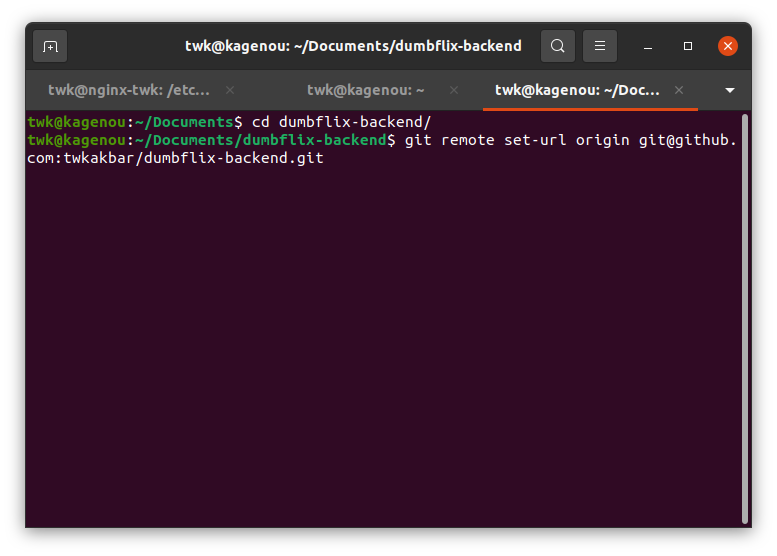

# Repository

1. Pertama buat terlebih dahulu repository di github

2. Kemudian clone kedua aplikasi

3. Ganti url remote ke repository saya

4. Buat 3 branch yaitu development, staging dan production

5. Push ke repository saya

6. Hasil dumbflix-frontend

dumbflix-backend

