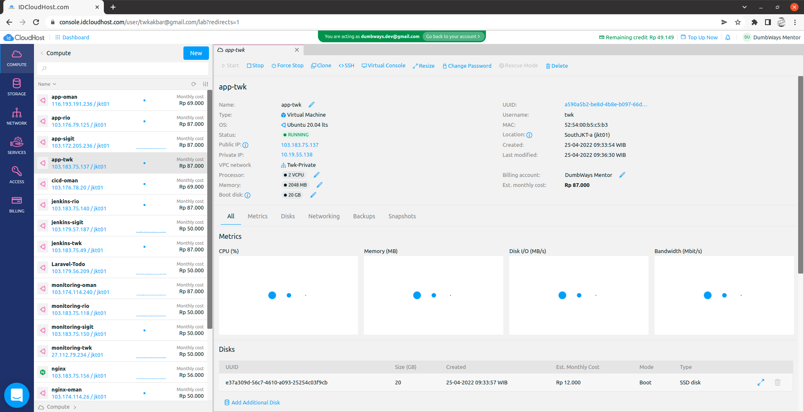
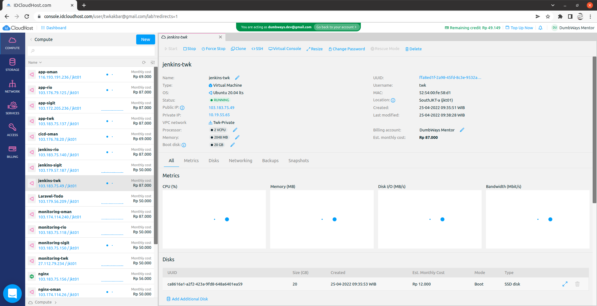
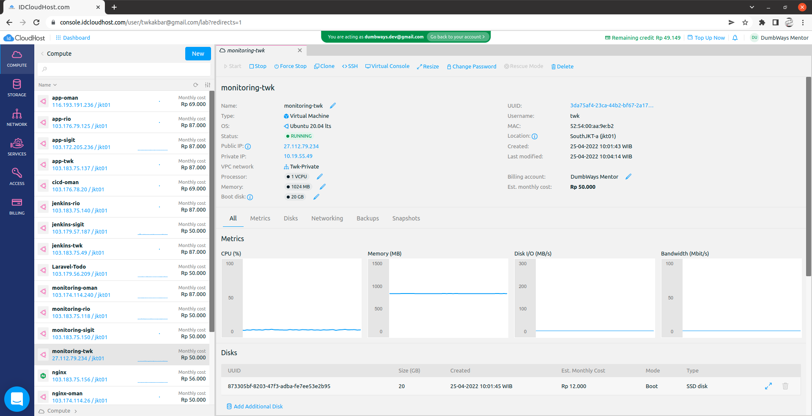
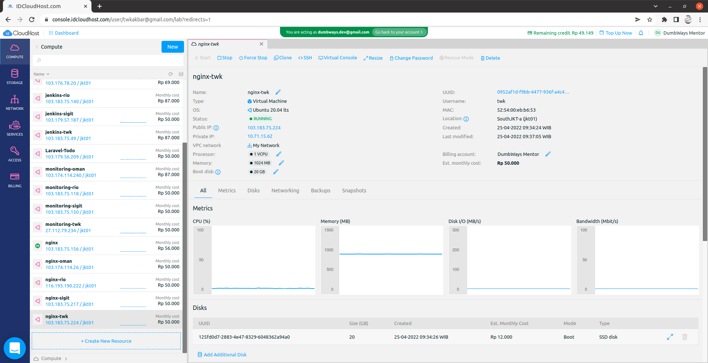
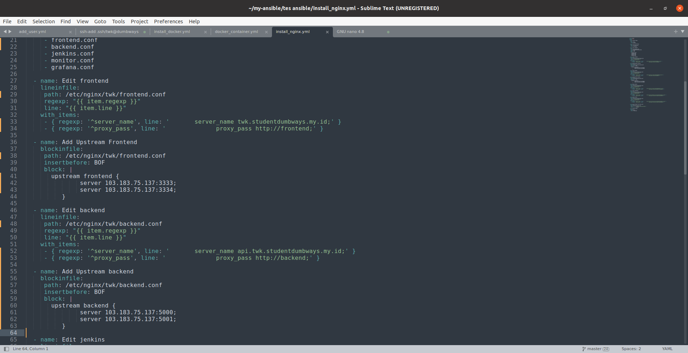

# Setup Ansible and Monitoring

1. Disini saya membuat 4 server dengan spesifikasi seperti berikut

Server APP (frontend & backend):



Server Jenkins:



Server Monitoring:



Server Nginx:



# Load Balancing

Untuk load balancing disini saya sudah menggunakan ansible, berikut playbook nya:



2. Install ansible di local

3. Buat file keypem yang digunakan agar server local dapat terhubung ke server target

4. Buat inventory yang berisi semua server target

5. Buat file ansible.cfg yang berisi konfigurasi letak dari keypem dan inventory

6. Disini saya membuat ansible untuk menginsatll docker, container nya, nginx, dan tambah user agar setup lebih cepat, berikut playbook nya:

Install docker:

```
- hosts: all
  become: true
  tasks:
   - name: "Update"
     apt:
        update_cache: yes

   - name: "Upgrade"
     apt:
        upgrade: yes

   - name: Install Req Docker
     apt:
      name:
      - ca-certificates
      - curl
      - gnupg-agent
      - python3-pip
      - software-properties-common

   - name: GPG Key Docker
     apt_key:
      url: https://download.docker.com/linux/ubuntu/gpg

   - name: Repo Docker
     apt_repository:
      repo: deb [arch=amd64] https://download.docker.com/linux/ubuntu bionic stable
      state: present
      update_cache: yes

   - name: Install Docker
     apt:
      name:
      - docker-ce
      - docker-ce-cli
      - containerd.io

   - name: Install Docker Py
     command: pip install docker

   - name: Install Docker Compose
     get_url:
      url: https://github.com/docker/compose/releases/download/1.27.4/docker-compose-Linux-x86_64
      dest: /usr/local/bin/docker-compose
      mode: 'u+x,g+x'

   - name: Executeable Docker Compose
     file:
      dest: /usr/local/bin/docker-compose
      mode: a+x

   - name: Give access user to access docker-ce
     shell: sudo usermod -aG docker $(whoami)
```

docker container:

```
- hosts: jenkins
  become: true
  tasks:
  - name: jenkins volume dir
    file:
     path: /home/jenkins/jenkins_home
     state: directory
     owner: 1000
     group: 1000

  - name: Pull jenkins
    docker_image:
     name: jenkins/jenkins:lts
     source: pull

  - name: Container jenkins
    docker_container:
     name: jenkins
     image: jenkins/jenkins
     ports:
      - 8080:8080
      - 50000:50000
     volumes: /home/jenkins/jenkins_home:/var/jenkins_home

- hosts: all
  become: true
  tasks:
  - name: Run Node Exporter
    shell: docker run -d --net="host" --pid="host" -v "/:/host:ro,rslave" --name nodeex quay.io/prometheus/node-exporter --path.rootfs=/host

- hosts: monitoring
  become: true
  tasks:
  - name: Make volume folder
    file:
     path: /home/monitoring/prometheus
     state: directory

  - name: Copy services
    copy:
     src: services/prometheus.yml
     dest: /home/monitoring/prometheus

  - name: Login to DockerHub
    docker_login:
     username: twkakbar
     password: Gangster54321?

  - name: Pull Prometheus
    become: true
    docker_image:
     name: bitnami/prometheus
     source: pull

  - name: Container Prometheus
    become: true
    docker_container:
     name: prometheus
     image: bitnami/prometheus
     ports:
      - 9090:9090
     volumes: /home/monitoring/prometheus:/etc/prometheus

  - name: Pull Grafana
    become: true
    docker_image:
     name: grafana/grafana    
     source: pull

  - name: Container Grafana
    become: true
    docker_container:
     name: grafana
     image: grafana/grafana
     ports:
      - 3000:3000

```

install nginx:

```
- hosts: nginx
  become: true
  tasks:
  - name: Install Nginx
    apt:
     name: nginx
     state: latest

  - name: Create New Folder
    file:
     path: /etc/nginx/twk
     state: directory

  - name: Copy variables
    copy:
     src: services/tmp.conf
     dest: /etc/nginx/twk/{{item}}
     group: root
     owner: root
    loop:
     - frontend.conf
     - backend.conf
     - jenkins.conf
     - monitor.conf
     - grafana.conf

  - name: Edit frontend
    lineinfile:
     path: /etc/nginx/twk/frontend.conf
     regexp: "{{ item.regexp }}"
     line: "{{ item.line }}"
    with_items:
     - { regexp: '^server_name', line: '       server_name twk.studentdumbways.my.id;' }
     - { regexp: '^proxy_pass', line: '              proxy_pass http://frontend;' }

  - name: Add Upstream Frontend
    blockinfile:
     path: /etc/nginx/twk/frontend.conf
     insertbefore: BOF
     block: |
       upstream frontend {
               server 103.183.75.137:3333;
               server 103.183.75.137:3334;
          }

  - name: Edit backend
    lineinfile:
     path: /etc/nginx/twk/backend.conf
     regexp: "{{ item.regexp }}"
     line: "{{ item.line }}"
    with_items:
     - { regexp: '^server_name', line: '       server_name api.twk.studentdumbways.my.id;' }
     - { regexp: '^proxy_pass', line: '              proxy_pass http://backend;' }

  - name: Add Upstream backend
    blockinfile:
     path: /etc/nginx/twk/backend.conf
     insertbefore: BOF
     block: |
       upstream backend {
               server 103.183.75.137:5000;
               server 103.183.75.137:5001;
          }

  - name: Edit jenkins
    lineinfile:
     path: /etc/nginx/twk/jenkins.conf
     regexp: "{{ item.regexp }}"
     line: "{{ item.line }}"
    with_items:
     - { regexp: '^server_name', line: '       server_name cicd.twk.studentdumbways.my.id;' }
     - { regexp: '^proxy_pass', line: '              proxy_pass http://103.183.75.49:8080;' }

  - name: Edit prometheus
    lineinfile:
     path: /etc/nginx/twk/monitor.conf
     regexp: "{{ item.regexp }}"
     line: "{{ item.line }}"
    with_items:
     - { regexp: '^server_name', line: '       server_name prometheus.twk.studentdumbways.my.id;' }
     - { regexp: '^proxy_pass', line: '              proxy_pass http://27.112.79.234:9090;' }

  - name: Edit grafana
    lineinfile:
     path: /etc/nginx/twk/grafana.conf
     regexp: "{{ item.regexp }}"
     line: "{{ item.line }}"
    with_items:
     - { regexp: '^server_name', line: '       server_name monitoring.twk.studentdumbways.my.id;' }
     - { regexp: '^proxy_pass', line: '              proxy_pass http://27.112.79.234:3000;' }


  - name: Add included file nginx.conf
    lineinfile:
     path: /etc/nginx/nginx.conf
     line: '        include /etc/nginx/twk/*;'
     insertafter: include.*

  - name: Restart Nginx
    service:
     name: nginx
     state: restarted
```

add user ke setiap server:

```
- hosts: nginx
  become: true
  tasks:
  - name: Add the user for nginx
    user:
     name: public
     groups: sudo,docker
     shell: /bin/bash
     append: yes
     password: '$6$qPrOaPBpm9T938nA$8dV2Rvmmzo355GIYApNJST8DypxHE9UCQedCbrpaRU/fD/aAdt7MmgNpttslQUBC6SuWRtgAXJR/K86uP92pq/'

- hosts: app
  become: true
  tasks:
  - name: Add the user for app
    user:
     name: app
     groups: sudo,docker
     shell: /bin/bash
     append: yes
     password: '$6$qPrOaPBpm9T938nA$8dV2Rvmmzo355GIYApNJST8DypxHE9UCQedCbrpaRU/fD/aAdt7MmgNpttslQUBC6SuWRtgAXJR/K86uP92pq/'

- hosts: jenkins
  become: true
  tasks:
  - name: Add the user for jenkins
    user:
     name: jenkins
     groups: sudo,docker
     shell: /bin/bash
     append: yes
     password: '$6$qPrOaPBpm9T938nA$8dV2Rvmmzo355GIYApNJST8DypxHE9UCQedCbrpaRU/fD/aAdt7MmgNpttslQUBC6SuWRtgAXJR/K86uP92pq/'

- hosts: monitoring
  become: true
  tasks:
  - name: Add the user for monitoring
    user:
     name: monitoring
     groups: sudo,docker
     shell: /bin/bash
     append: yes
     password: '$6$qPrOaPBpm9T938nA$8dV2Rvmmzo355GIYApNJST8DypxHE9UCQedCbrpaRU/fD/aAdt7MmgNpttslQUBC6SuWRtgAXJR/K86uP92pq/'

Config & Restart SSHD
- hosts: all
  become: true
  tasks:
      - name: Change SSHD Config
        lineinfile:
          path: /etc/ssh/sshd_config
          regexp: '^PasswordAuthentication no'
          line: 'PasswordAuthentication yes'

      - name: Restart SSHD Service
        service:
          name: sshd
          state: restarted
```


