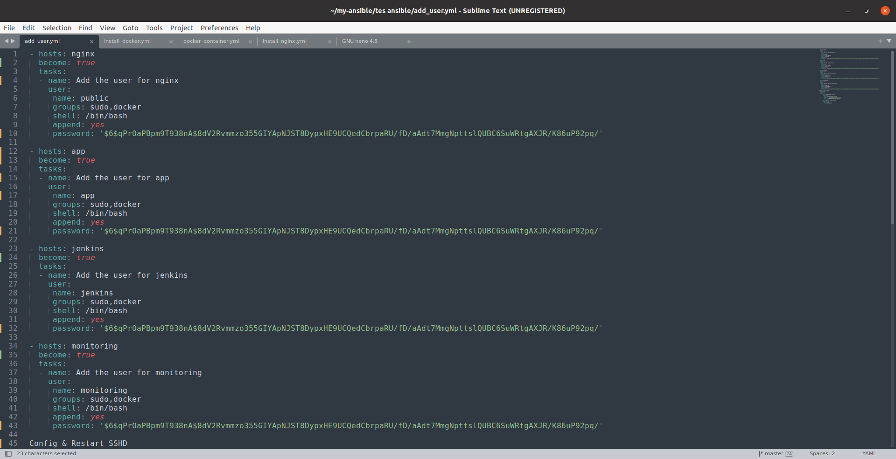
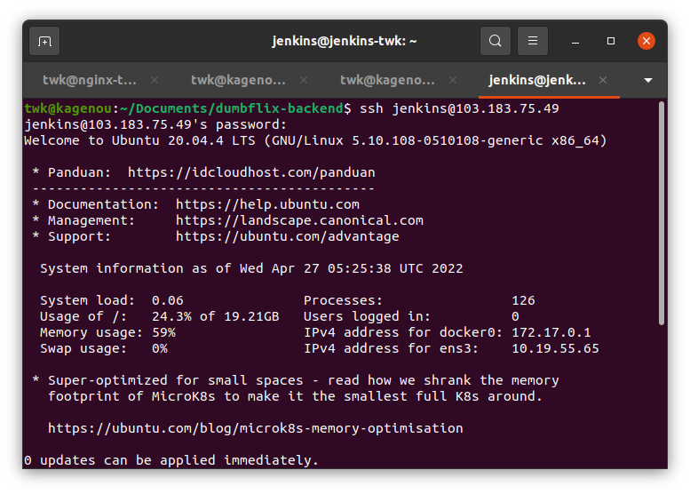

# Membuat user baru disetiap server


1. Untuk menambah user baru disini saya juga menggunakan ansible, berikut playbooknya:

```
- hosts: nginx
  become: true
  tasks:
  - name: Add the user for nginx
    user:
     name: public
     groups: sudo,docker
     shell: /bin/bash
     append: yes
     password: '$6$qPrOaPBpm9T938nA$8dV2Rvmmzo355GIYApNJST8DypxHE9UCQedCbrpaRU/fD/aAdt7MmgNpttslQUBC6SuWRtgAXJR/K86uP92pq/'

- hosts: app
  become: true
  tasks:
  - name: Add the user for app
    user:
     name: app
     groups: sudo,docker
     shell: /bin/bash
     append: yes
     password: '$6$qPrOaPBpm9T938nA$8dV2Rvmmzo355GIYApNJST8DypxHE9UCQedCbrpaRU/fD/aAdt7MmgNpttslQUBC6SuWRtgAXJR/K86uP92pq/'

- hosts: jenkins
  become: true
  tasks:
  - name: Add the user for jenkins
    user:
     name: jenkins
     groups: sudo,docker
     shell: /bin/bash
     append: yes
     password: '$6$qPrOaPBpm9T938nA$8dV2Rvmmzo355GIYApNJST8DypxHE9UCQedCbrpaRU/fD/aAdt7MmgNpttslQUBC6SuWRtgAXJR/K86uP92pq/'

- hosts: monitoring
  become: true
  tasks:
  - name: Add the user for monitoring
    user:
     name: monitoring
     groups: sudo,docker
     shell: /bin/bash
     append: yes
     password: '$6$qPrOaPBpm9T938nA$8dV2Rvmmzo355GIYApNJST8DypxHE9UCQedCbrpaRU/fD/aAdt7MmgNpttslQUBC6SuWRtgAXJR/K86uP92pq/'

Config & Restart SSHD
- hosts: all
  become: true
  tasks:
      - name: Change SSHD Config
        lineinfile:
          path: /etc/ssh/sshd_config
          regexp: '^PasswordAuthentication no'
          line: 'PasswordAuthentication yes'

      - name: Restart SSHD Service
        service:
          name: sshd
          state: restarted
```



2. Tes masuk ke server jenkins dengan user baru yaitu user jenkins



