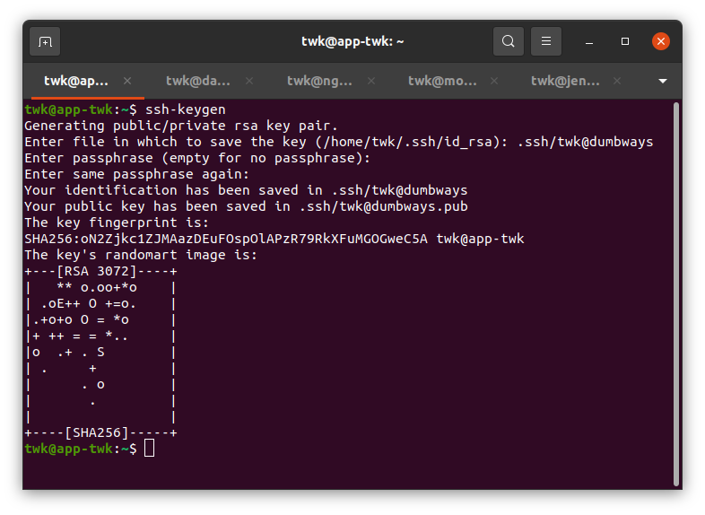
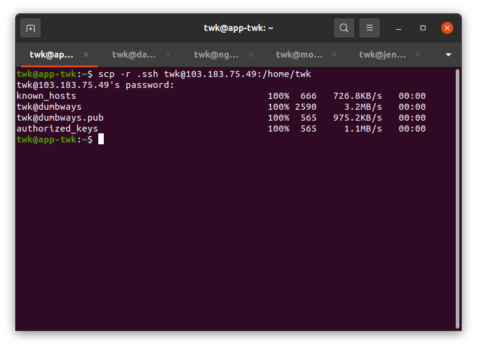
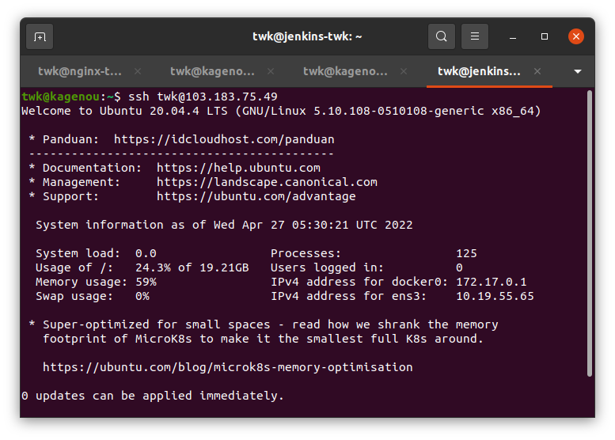
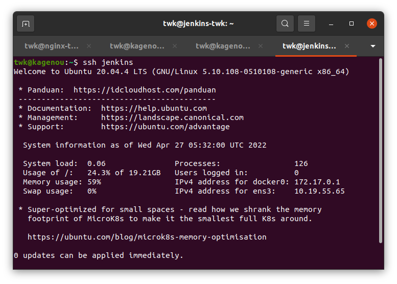
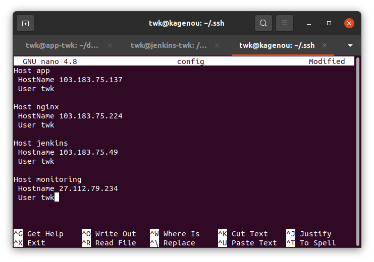

# Setup Ansible and Monitoring

## Langkah 1 - Ansible Installation (Dilakukan di local)

1. Generate ssh dengan nama@dumbways, sebagai contoh disini twk@dumbways

2. Lalu coyp ssh ke semua server

3. Setelah ssh di copy ke semua server, masukkan public key ke authorized key agar dapat login tanpa password

4. Untuk tambahan disini saya membuat config host agar dapat login hanya menggunakan nama host seperti gambar berikut

Config nya:

