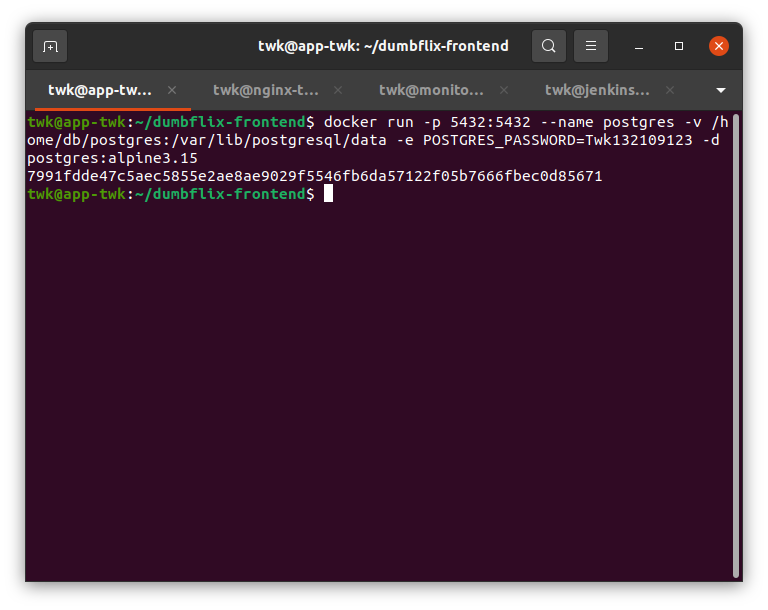
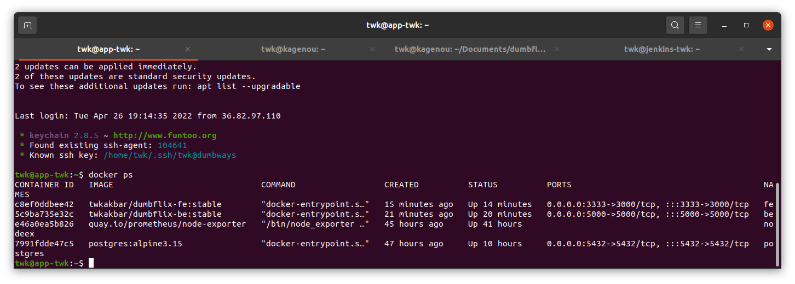
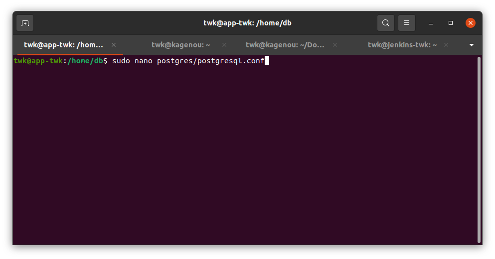
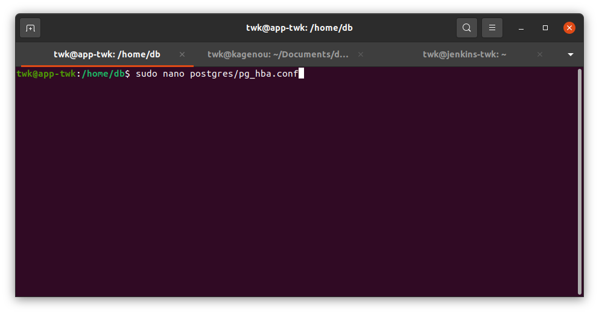
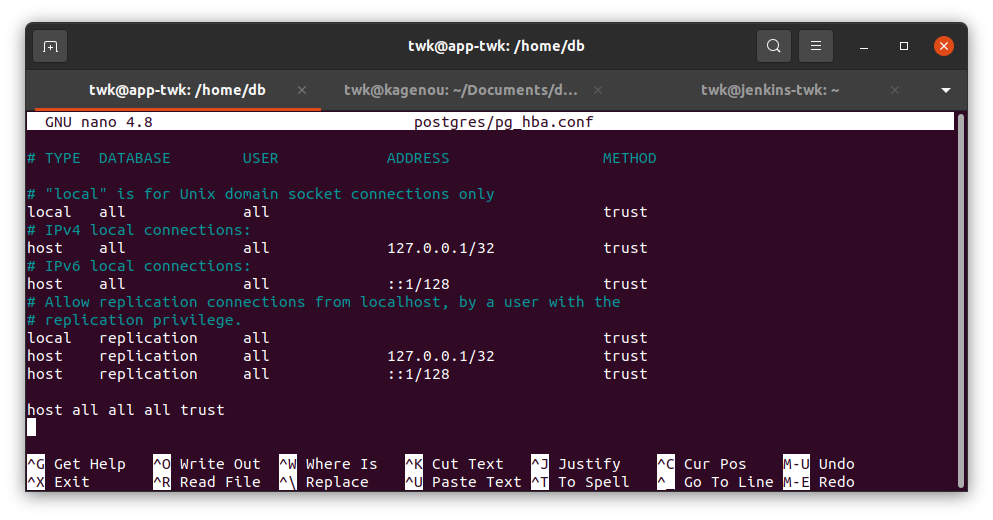
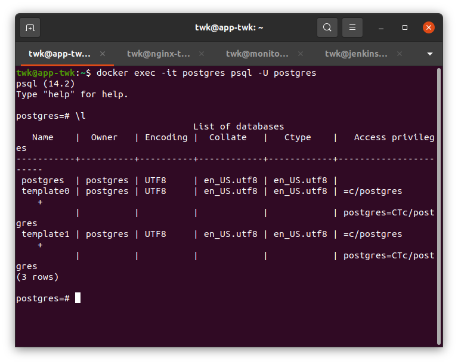
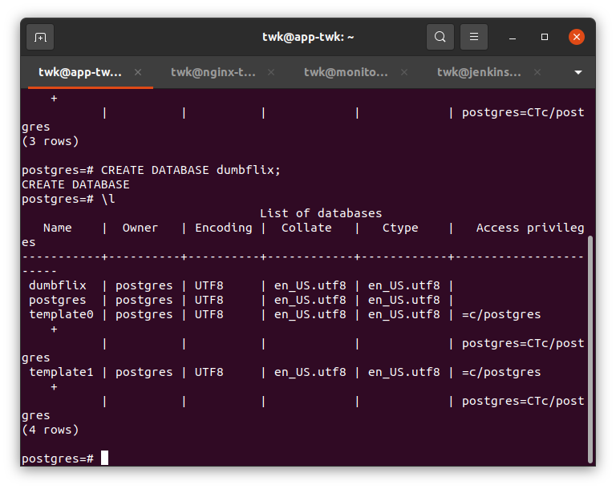
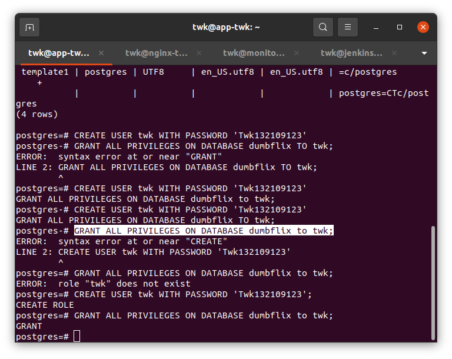
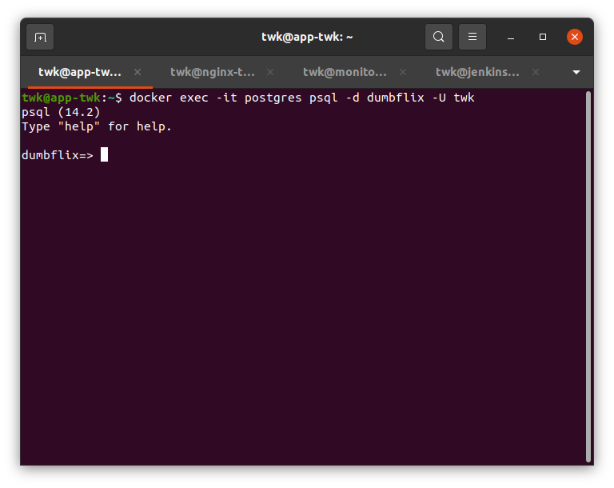

# Database

1. Run database postgresql menggunakan docker dengan perintah berikut:

```
docker run -p 5432:5432 --name postgres -v /home/db/postgres:/var/lib/postgresql/data -e POSTGRES_PASSWORD=twk -d postgres:alpine3.15
```



2. Lihat isi container apakah postgres sudah berjalan



3. Sekarang masuk ke postgresql.conf dan ubah listen_address ke * agar server dapat di remote menggunakan server lain




4. Setelah mengubah postgresql.conf selanjutnya adalah mengijinkan postgre untuk menerima remote dari server lain dengan cara edit pg_hba.conf dan ubah method ke trust






5. Sekarang masuk ke container postgresql dan show database nya

```
docker exec -it postgres psql -U postgres
```



6. Sekarang buat database bernama dumbflix



7. Tambah user baru yang bernama twk beserta password nya dan berikan privileges atau izin user twk ke database dumbflix



8. Masuk lagi ke container database dengan menggunakan user twk dan database dumbflix



