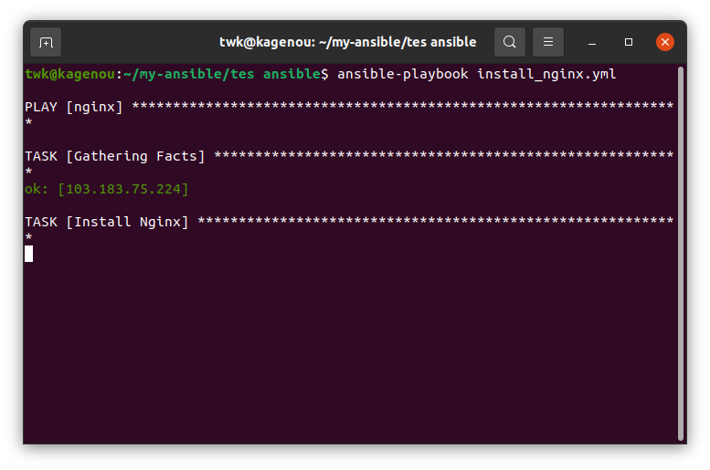
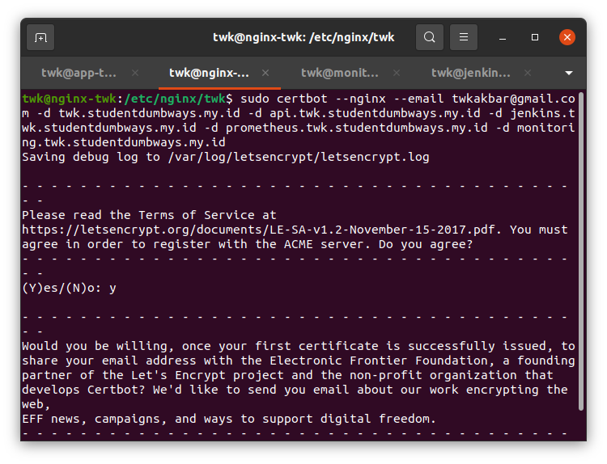
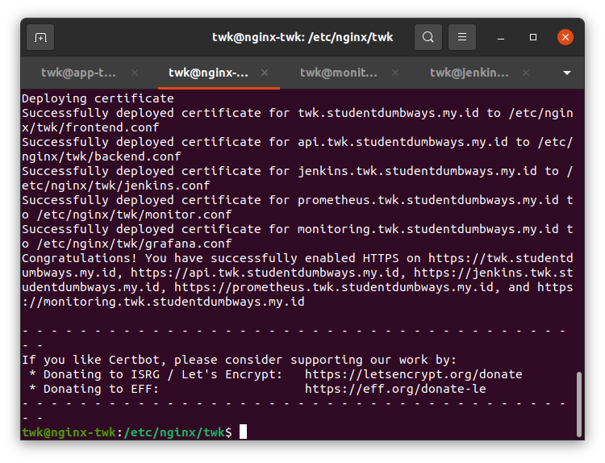

# Webserver

1. Untuk nginx dan konfigurasinya beserta load balancing saya menggunakan ansible, berikut playbooknya:

```
- hosts: nginx
  become: true
  tasks:
  - name: Install Nginx
    apt:
     name: nginx
     state: latest

  - name: Create New Folder
    file:
     path: /etc/nginx/twk
     state: directory

  - name: Copy variables
    copy:
     src: services/tmp.conf
     dest: /etc/nginx/twk/{{item}}
     group: root
     owner: root
    loop:
     - frontend.conf
     - backend.conf
     - jenkins.conf
     - monitor.conf
     - grafana.conf

  - name: Edit frontend
    lineinfile:
     path: /etc/nginx/twk/frontend.conf
     regexp: "{{ item.regexp }}"
     line: "{{ item.line }}"
    with_items:
     - { regexp: '^server_name', line: '       server_name twk.studentdumbways.my.id;' }
     - { regexp: '^proxy_pass', line: '              proxy_pass http://frontend;' }

  - name: Add Upstream Frontend
    blockinfile:
     path: /etc/nginx/twk/frontend.conf
     insertbefore: BOF
     block: |
       upstream frontend {
               server 103.183.75.137:3333;
               server 103.183.75.137:3334;
          }

  - name: Edit backend
    lineinfile:
     path: /etc/nginx/twk/backend.conf
     regexp: "{{ item.regexp }}"
     line: "{{ item.line }}"
    with_items:
     - { regexp: '^server_name', line: '       server_name api.twk.studentdumbways.my.id;' }
     - { regexp: '^proxy_pass', line: '              proxy_pass http://backend;' }

  - name: Add Upstream backend
    blockinfile:
     path: /etc/nginx/twk/backend.conf
     insertbefore: BOF
     block: |
       upstream backend {
               server 103.183.75.137:5000;
               server 103.183.75.137:5001;
          }

  - name: Edit jenkins
    lineinfile:
     path: /etc/nginx/twk/jenkins.conf
     regexp: "{{ item.regexp }}"
     line: "{{ item.line }}"
    with_items:
     - { regexp: '^server_name', line: '       server_name cicd.twk.studentdumbways.my.id;' }
     - { regexp: '^proxy_pass', line: '              proxy_pass http://103.183.75.49:8080;' }

  - name: Edit prometheus
    lineinfile:
     path: /etc/nginx/twk/monitor.conf
     regexp: "{{ item.regexp }}"
     line: "{{ item.line }}"
    with_items:
     - { regexp: '^server_name', line: '       server_name prometheus.twk.studentdumbways.my.id;' }
     - { regexp: '^proxy_pass', line: '              proxy_pass http://27.112.79.234:9090;' }

  - name: Edit grafana
    lineinfile:
     path: /etc/nginx/twk/grafana.conf
     regexp: "{{ item.regexp }}"
     line: "{{ item.line }}"
    with_items:
     - { regexp: '^server_name', line: '       server_name monitoring.twk.studentdumbways.my.id;' }
     - { regexp: '^proxy_pass', line: '              proxy_pass http://27.112.79.234:3000;' }


  - name: Add included file nginx.conf
    lineinfile:
     path: /etc/nginx/nginx.conf
     line: '        include /etc/nginx/twk/*;'
     insertafter: include.*

  - name: Restart Nginx
    service:
     name: nginx
     state: restarted
```



2. Untuk ssl saya menggunakan certbot seperti gambar berikut:



dan hasilnya



