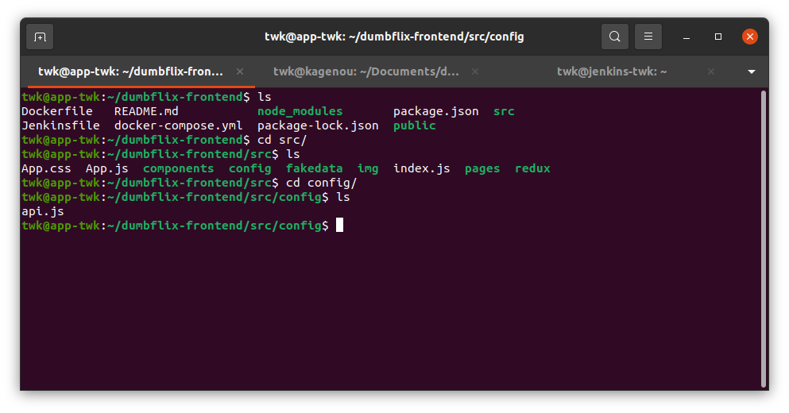
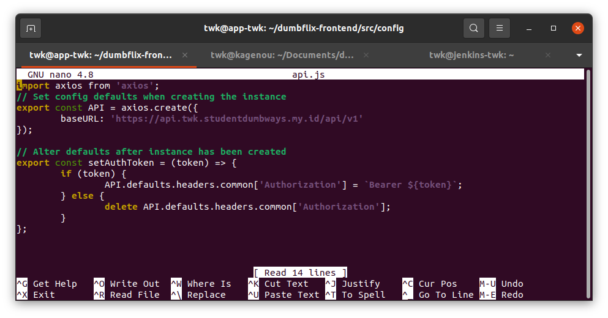
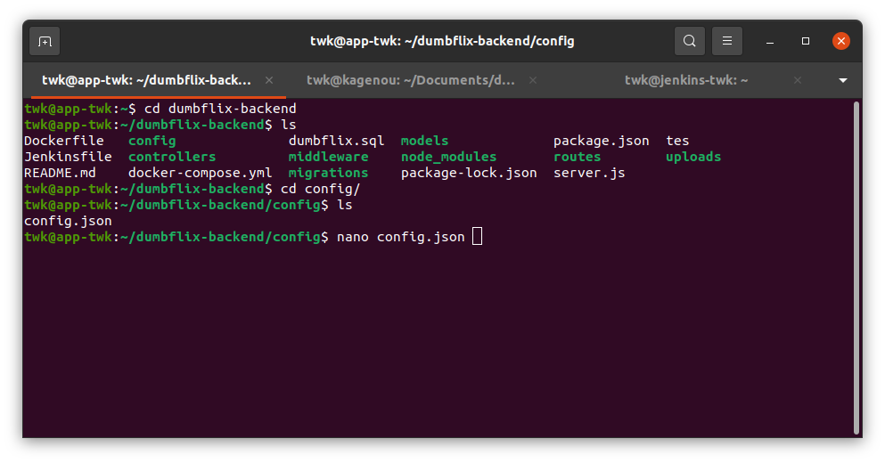
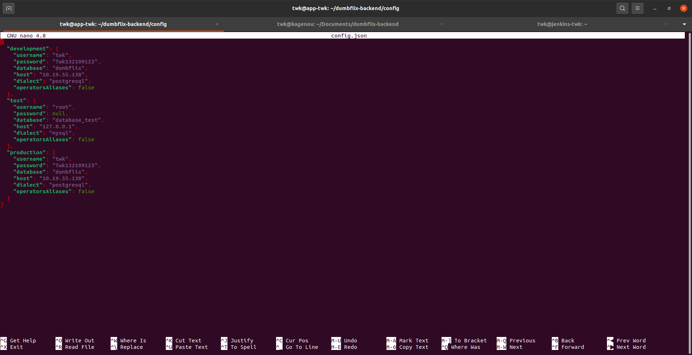
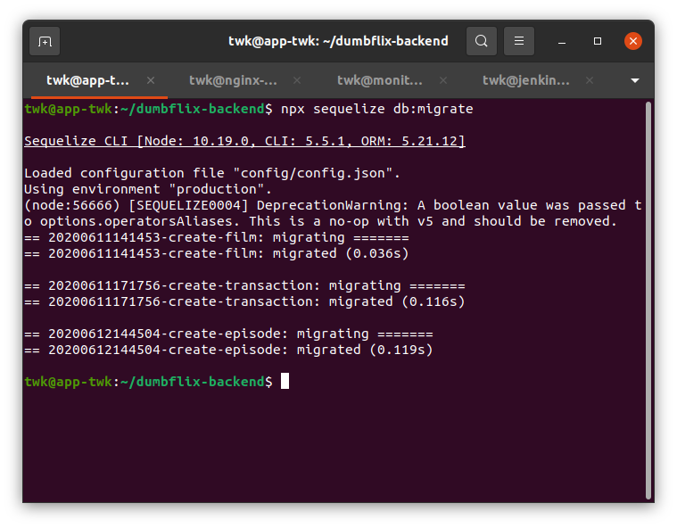
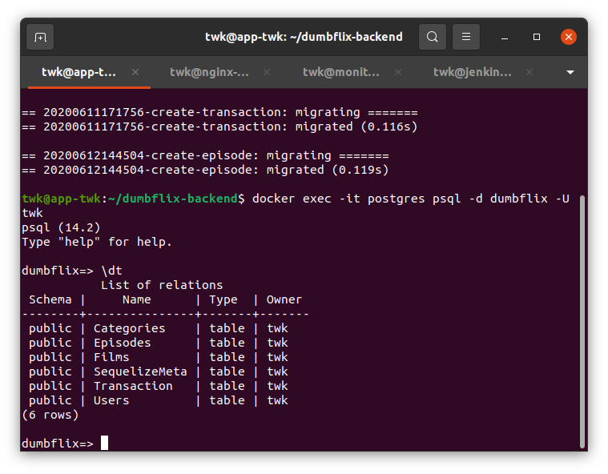
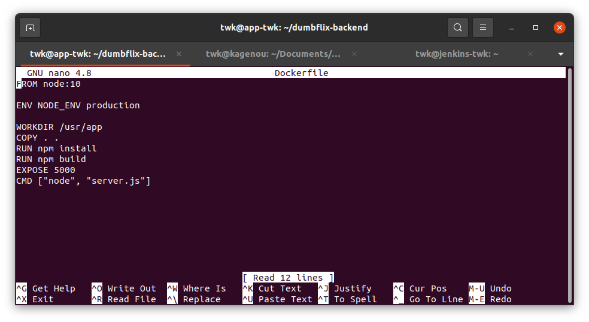
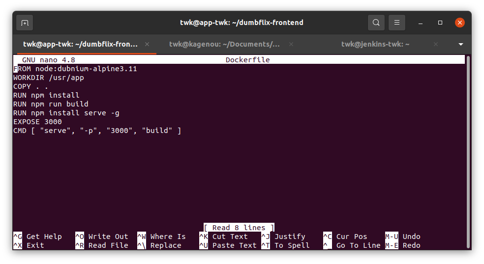
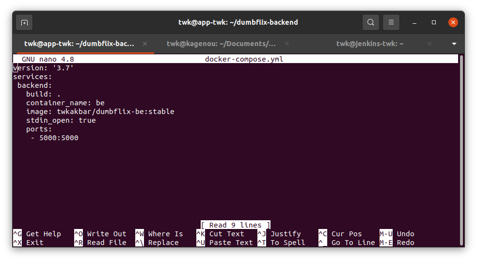
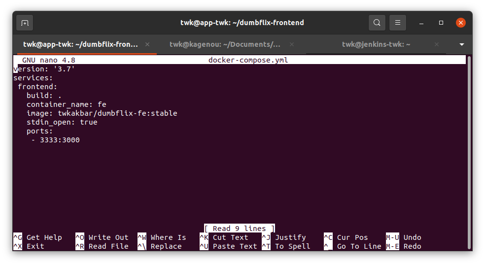

# Deployment


1. Sebelumnya saya sudah clone backend dan frontend, sekarang saya akan setup keduanya, untuk frontend edit api.js di bagian baseURL untuk menghubungkan frontend ke backend





2. Untuk backend edit config.json dan masukkan credential postgtresql yang sudah saya setup tadi dan masukkan ip private nya





3. Sekarang saya akan melakukan migrasi ke database, agar menggunakan environtment production gunakan `export NODE_ENV=production` kemudian lakukan migrasi menggunakan sequelize dengan perintah npx sequelize db:migrate



4. Sekarang cek tabel nya apakah sudah di migrasi



5. Sekarang buat dockerfile untuk build si aplikasi seperti gambar berikut:

backend:



frontend:



6. Sekarang kita buat file docker-compose.yml, docker compose ini digunakan untuk mempercepat dan mempermudah pembuatan service atau aplikasi pada sebuah container

backend:



frontend:



7. Jika sudah jalankan menggunakan perintah berikut:

```
docker-compose up -d
```

Hasil frontend


Hasil backend


