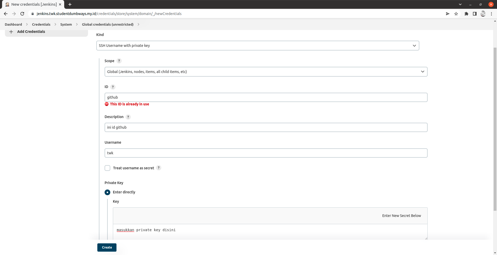
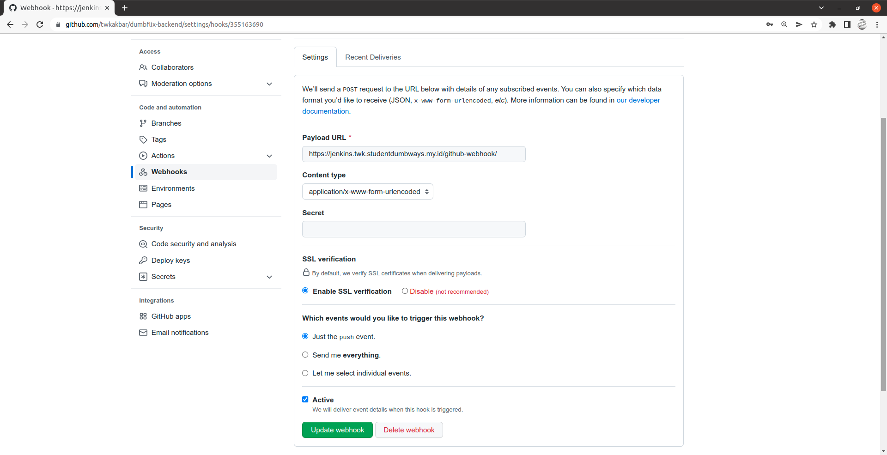

# CICD

1. Untuk CICD juga saya sudah melakukan instalasi on top docker menggunakan ansible, berikut playbooknya:

```
- hosts: jenkins
  become: true
  tasks:
  - name: jenkins volume dir
    file:
     path: /home/jenkins/jenkins_home
     state: directory
     owner: 1000
     group: 1000

  - name: Pull jenkins
    docker_image:
     name: jenkins/jenkins:lts
     source: pull

  - name: Container jenkins
    docker_container:
     name: jenkins
     image: jenkins/jenkins
     ports:
      - 8080:8080
      - 50000:50000
     volumes: /home/jenkins/jenkins_home:/var/jenkins_home
```

2. Karena sebelumnya di nginx sudah setup reverse proxy, maka masukkan link nya ke browser dan akan diminta password seperti ini, maka masukkan saja password yang ada di server kita


3. Berikut halaman utama jenkins


4. Masuk ke plugin manager dan download ssh agent


5. Juga download publish over ssh sesuai tugas final task


6. Sekarang kita akan konfigurasi publish over ssh, masuk ke configure system dan pada bagian publish over ssh, masukkan private key nya dan host server app kita


Lalu tes koneksi


7. Sekarang konfigurasi user untuk ke github dengan cara masuk ke manage credential




8. Sekarang kita akan buat job baru CICD yaitu untuk dumbflix-frontend dan dumbflix-backend, klik new item dan masukkan nama project kita, disini saya menggunakan freestyle project untuk menggunakan publish over ssh dan discord notifier


9. Disini pilih git dan masukkan url kita dan credential yang kita buat di step 7 tadi


Centang GitHub hook trigger for GITScm polling agar dapat di trigger di perubahan github


Nah disini masukkan publish over ssh yang kita buat tadi, pilih ssh server kita seperti gambar berikut


Dan disini tambahkan Discord Notifier agar notifikasi dapat dikirim di discord


Berikut hasil notifikasi dari discord notifier ketika trigger di github


10. Agar CICD dapat trigger di github, kita tambahkan webhook jenkins di github kita




