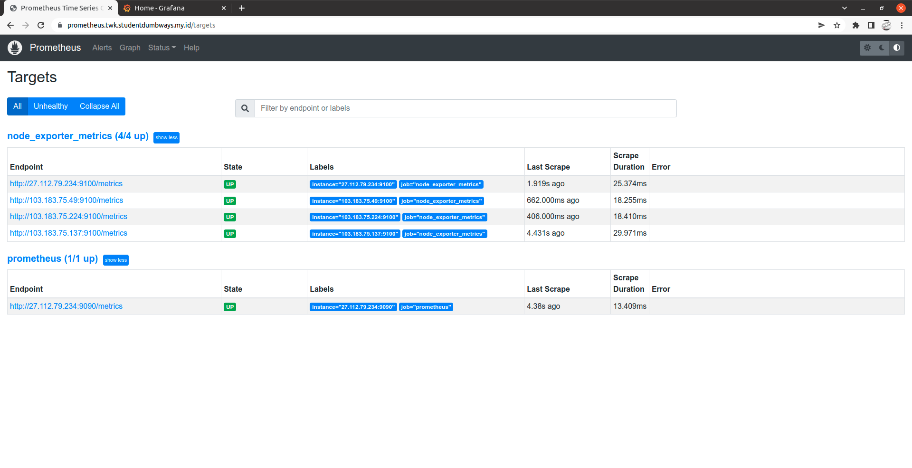
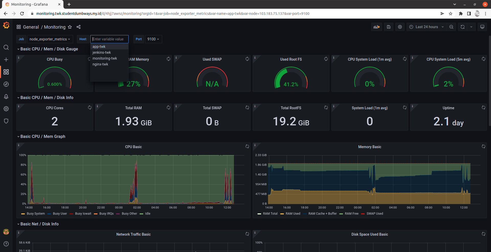
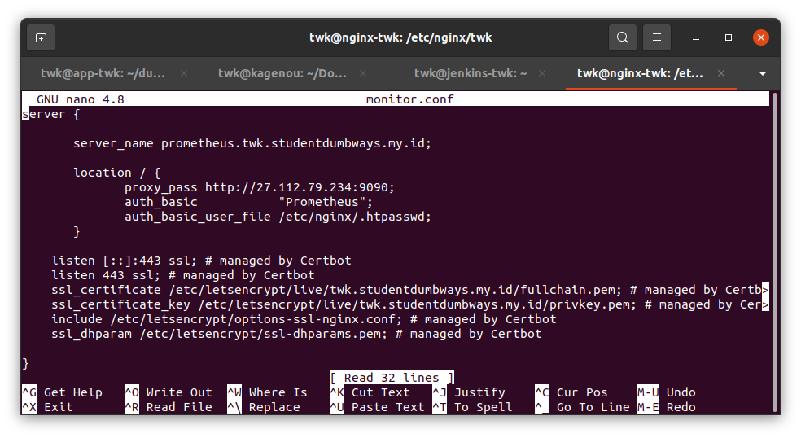

# Monitoring

1. Juga untuk intalasi monitoring saya sudah menggunakan ansible, berikut playbooknya:

```
- hosts: all
  become: true
  tasks:
  - name: Run Node Exporter
    shell: docker run -d --net="host" --pid="host" -v "/:/host:ro,rslave" --name nodeex quay.io/prometheus/node-exporter --path.rootfs=/host

- hosts: monitoring
  become: true
  tasks:
  - name: Make volume folder
    file:
     path: /home/monitoring/prometheus
     state: directory

  - name: Copy services
    copy:
     src: services/prometheus.yml
     dest: /home/monitoring/prometheus

  - name: Login to DockerHub
    docker_login:
     username: twkakbar
     password: Gangster54321?

  - name: Pull Prometheus
    become: true
    docker_image:
     name: bitnami/prometheus
     source: pull

  - name: Container Prometheus
    become: true
    docker_container:
     name: prometheus
     image: bitnami/prometheus
     ports:
      - 9090:9090
     volumes: /home/monitoring/prometheus:/etc/prometheus

  - name: Pull Grafana
    become: true
    docker_image:
     name: grafana/grafana    
     source: pull

  - name: Container Grafana
    become: true
    docker_container:
     name: grafana
     image: grafana/grafana
     ports:
      - 3000:3000
```

2. Cek pada browser untuk melihat apakah prometheus dan grafana sudah berjalan

prometheus:



grafana:



3. Agar ketika mengakses prometheus harus menggunakan password, gunakan perintah berikut:

```
sudo apt-get install apache2-utils
```

Lalu generate password nya menggunakan:

```
sudo htpasswd -c /etc/nginx/.htpasswd public
```

Kemudian masuk ke konfigurasi reverse proxy nginx prometheus dan masukkan konfigurasi berikut:

```
auth_basic           "Prometheus";
auth_basic_user_file /etc/nginx/.htpasswd;
```




