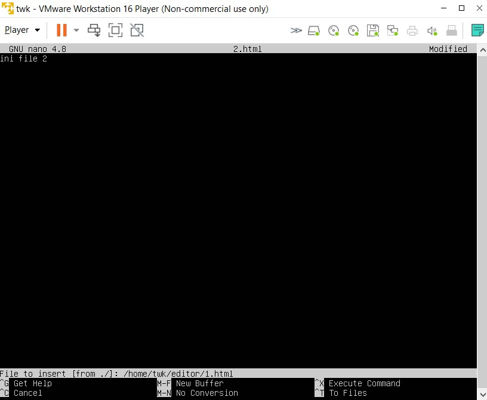
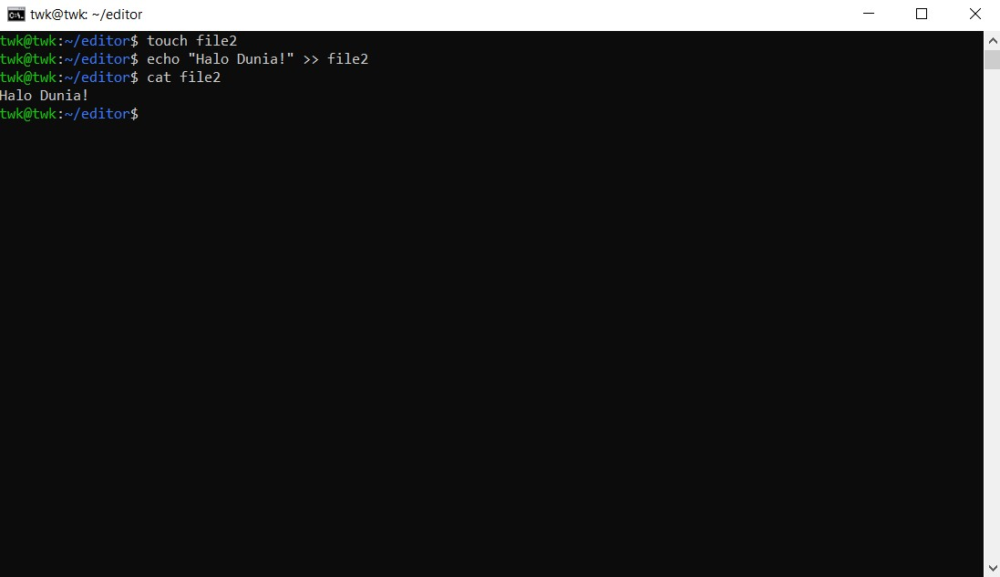

# Day 6
Pada hari ini kami mempelajari tentang text editor, text manipulation, monitoring, service management hingga network firewal

# 1. Text Editor Shortcut (Nano)
Text Editor adalah sebuah aplikasi yang berjalan di atas terminal, gunanya untuk melakukan manipulasi data pada sebuah file. Pada sebuah server kita wajib mengetahui penggunaan text editor karena di server tidak ada aplikasi yang bersifat GUI.

## Shortcut Nano
Secara default nano sudah terinstall pada sistem operasi linux, untuk memeriksanya kalian bisa gunakan perintah berikut :
```
nano --version
```


#### 1. Membuka Nano
cara membuka file nano dapat menggunakan perintah berikut
```
nano (file-name)
```


```
nano (location/folder/file-name)
```


keterangan : location/aplikasi-go-saya/index.go merupakan file yang lokasinya berada dalam folder/directory.

#### 2. Keluar dari text editor
`ctrl + X` untuk keluar dari editor. Jika melakukan perubahan maka akan dimintai konfirmasi apakah perubahan akan disimpan / tidak. Ketik Y untuk yes, dan N untuk No kemudian tekan Enter.


Jika kalian ingin mengubah nama dari file, kalian dapat mengubah nama dari yang sebelumnya index.go menjadi nama file yang kalian inginkan, jika
tidak kalian bisa langsung enter tanpa mengganti namanya seperti digambar berikut:


`ctrl + O` adalah untuk menyimpan perubahan file tanpa harus keluar dari text editor nano. Kemudian tekan Enter.


#### 3. Mencari text
`ctrl + W` adalah untuk mencari text. Masukkan value ke kolom pencarian kemudian tekan Enter.


#### 4. Choose text
`ALT + A` : adalah untuk memilih text, cukup arahkan cursor sesuai text yang ingin di select.


#### 5. Copy and Paste
`ALT + 6` : untuk melakukan copy text yang sudah di select

`CTRL + U` : untuk melakukan paste text yang sudah di copy


#### 6. Cut text and Paste
`CTRL + K` : untuk melakukan cut pada text yang sudah di select


`CTRL + U` : untuk melakukan paste text yang sudah di cut


#### 7. Move cursor
`CTRL + A` : untuk pindah cursor ke awal baris


`CTRL + E` : untuk pindah cursor ke akhir baris


#### 8. Ambil konten dari file lain


Kalau kita lihat disini saya memilik file bernama 1.html di dalam directory editor. Sekarang kita akan coba untuk mengambil isi dari file 1.html tersebut ke 
dalam file 2.html kita.

`CTRL + R` : untuk mengambil isi dari suatu file



Kemudian masukan lokasi yang sesuai dengan file yang isinya ingin kalian ambil


# 2. Text Manipulation

#### 1. cat
`Cat` adalah salah satu perintah yang berfungsi untuk membuat daftar konten atau isi file pada standard output (sdout). Yang kalian tahu pasti perintah `cat` hanya bisa untuk melihat isi dari suatu file, sebenarnya tidak hanya itu.

Contoh penggunaan :

Untuk melihat isi dari suatu file

```
cat (file-name)
```


Untuk membuat suatu file baru serta memasukkan teks, Jika sudah menambakan teks kalian dapat keluar dengan klik CTRL + C.

```
cat > (file-name)
```


Kemudian untuk menggabungkan dua buah file, dan menyimpannya ke dalam test3.go

```
cat test.go test2.go > test3.go
```


#### 2. sed
`Sed` adalah singkatan dari stream editor. Gunanya untuk memanipulasi teks dasar pada file. Dengan `sed` kita dapat mengganti teks dengan cepat.
```
sed -i 's/Hello/Holla/g' file3
```

Disini saya mengganti semua kata test menjadi testing pada test3.go


#### 3. grep
`Grep` merupakan perintah untuk melakukan pencarian sebuah text dalam sebuah file yang telah dibuat.

Contoh:

Saya akan mencari kata testing pada test3.go

```
grep testing test3.go
```


Untuk menghitung jumlah kata “testing” pada test3.go

```
grep -c testing test3.go
```


Untuk mencari semua file yang berisikan kata testing gunakan perintah berikut:

```
grep testing *
```


#### 4. sort
`Sort` untuk mengurutkan data, baik itu secara ascending atau descending.

Gunakan perintah berikut untuk mengurutkan berdasarkan ascending:

```
sort file1
```


Gunakan perintah berikut untuk mengurutkan berdasarkan descending

```
sort -r file1
```


#### 5. echo
`Echo` digunakan untuk mencetak string / pesan dari hasil perintah lain.

Gunakan perintah berikut untuk mencetak string Hallo Dunia!

```
echo "Hallo Dunia!"
```


Gunakan perintah berikut untuk mencetak kata Halo Dunia! di file2

```
echo "Hello Dumbways!" >> file3
```



Gunakan perintah berikut untuk mereplace semua data di file2 dan menggantinya dengan "Replace semua data di file2"

```
echo "Replace semua data di file2" > file2
```


