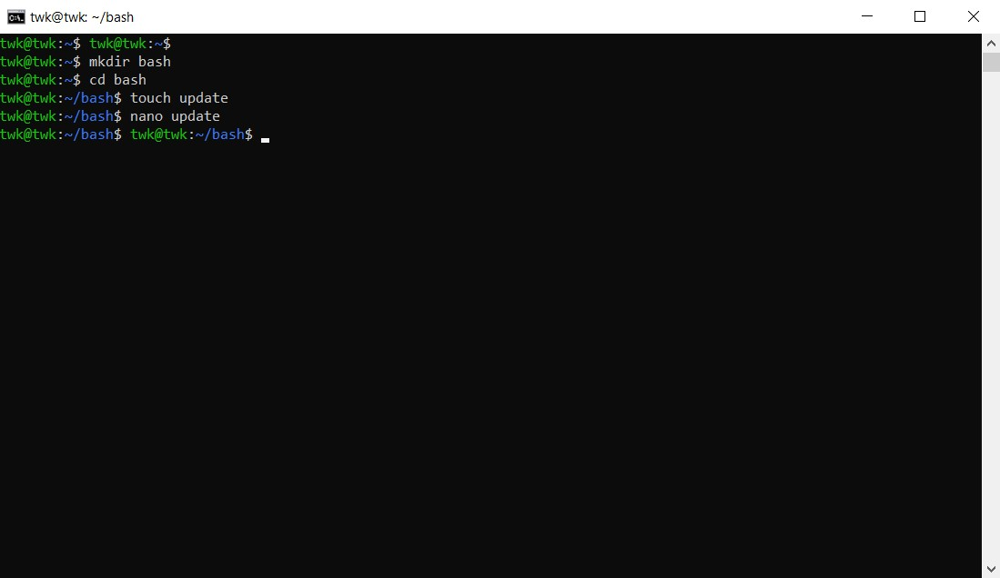
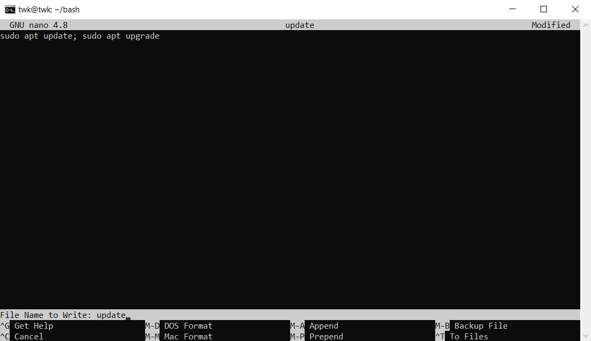
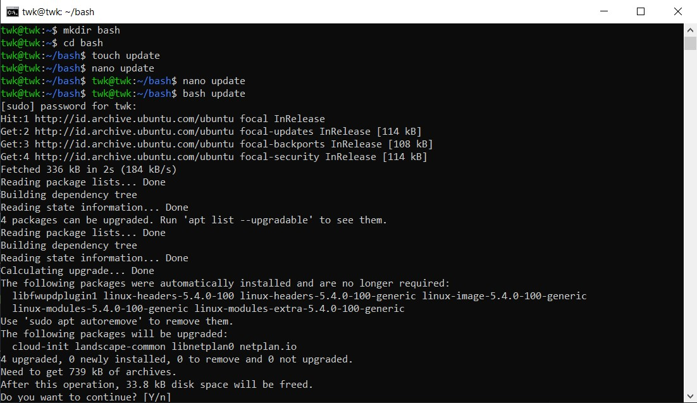

# Membuat File Bash Script untuk Update Upgrade System dan Firewall

## Langkah 1 - Bash Update dan Upgrade

1. Disini saya membuat directory baru yaitu "bash" kemudian di dalam directory tersebut saya membuat 1 file yang bernama update kemudian nano. 



Edit file tersebut dengan nano dan masukkan script berikut:

```
sudo apt update; sudo apt upgrade
```



Kemudian jalankan script bash berikut dengan perintah berikut:

```
bash update
```



Bash Script untuk Update dan Upgrade Berhasil jika muncul seperti gambar diatas.
