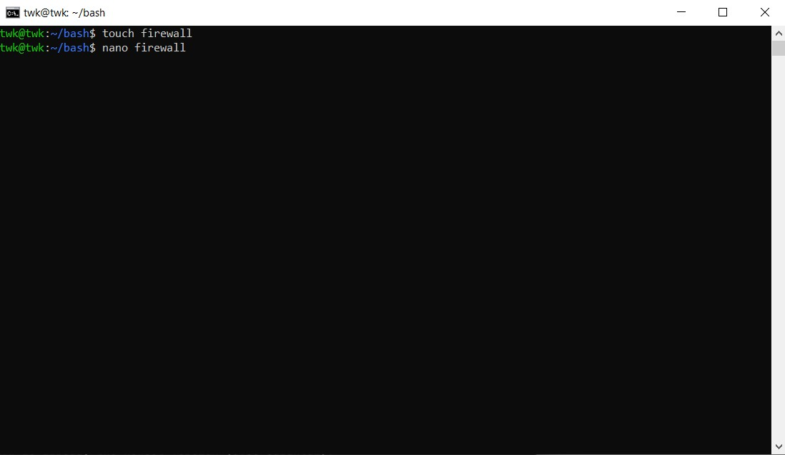
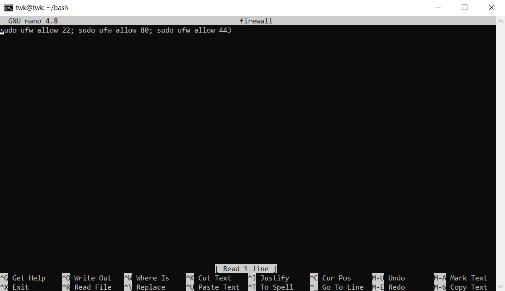
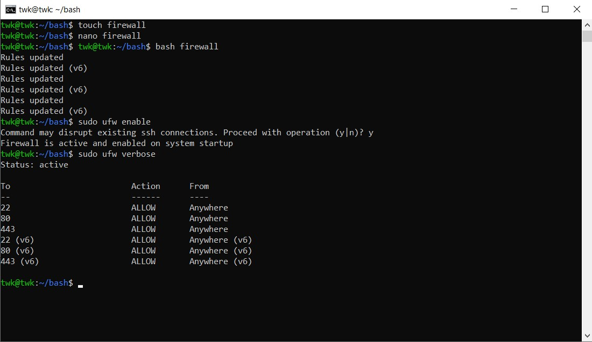

# Membuat File Bash Script untuk Update Upgrade System dan Firewall

## Langkah 1 - Bash Update dan Upgrade

<p>1. Disini saya membuat directory baru yaitu "bash" kemudian di dalam directory tersebut saya membuat 1 file yang bernama update kemudian nano. 


<p>2. Edit file tersebut dengan nano dan masukkan script berikut:

```
sudo apt update; sudo apt upgrade
```


<p>3. Kemudian jalankan script bash berikut dengan perintah berikut:

```
bash update
```


Bash Script untuk Update dan Upgrade Berhasil jika muncul seperti gambar diatas.

## Langkah 2 - Bash Firewall Allow port 20, 80,443
1. Disini saya membuat file baru didalam directory Bash dengan nama firewall, kemudian nano


  
2. Masukkan script berikut kedalam file firewall dengan menggunakan nano:
  
```
sudo ufw allow 22; sudo ufw allow 80; sudo ufw allow 443
```
  

  
3. Jalankan file firewall tadi, hidupkan firewall dan cek hasil firewallnya dengan perintah berikut:

Untuk menjalankan file bash script:
  
```
bash firewall
```
  
Untuk menghidupkan firewall

```
sudo ufw enable
```
 
Untuk mengecek status firewall dan melihat koneksi yang ada
  
```
sudo ufw verbose
```
  

