# Load Balancing Aplikasi Wayshub 

## Langkah 1 - Instalasi Yarn

<p>1. Langkah pertama adalah saya clone aplikasi wayshub dan install Yarn Karena aplikasi yang saya gunakan menggunakan yarn dan react maka terlebih dahulu kita 
install yarn nya 

Install yarn menggunakan NPM:

```
npm install --global yarn
```

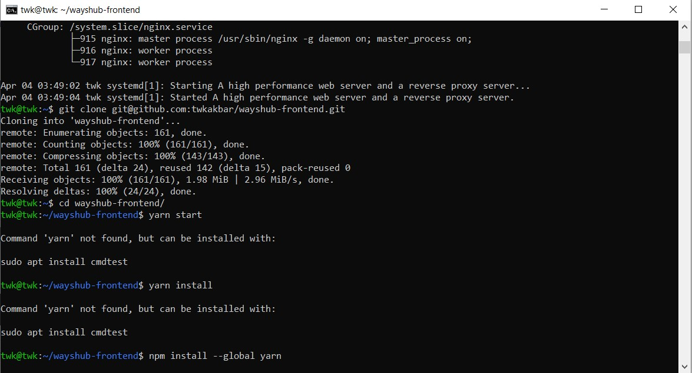


## Langkah 2 - Reverse Proxy

<p>1. Masuk ke folder nginx setelah itu buat suatu directory baru telebih dahulu

Masuk ke folder nging

```
cd /etc/nginx
```

Buat directory baru bernama wayshub

```
sudo mkdir wayshub
```

Masuk ke directory wayshub kemudian buat file baru dan masukkan konfigurasi nya

```
cd wayshub
```

```
sudo nano my.reverse-proxy.conf
```

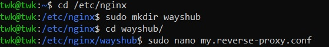

<p>2. Masukkan konfigurasi berikut:

```
server { 
    server_name wayshub.xyz; 
  
    location / { 
             proxy_pass http://127.0.0.1:3000;
    }
}
```

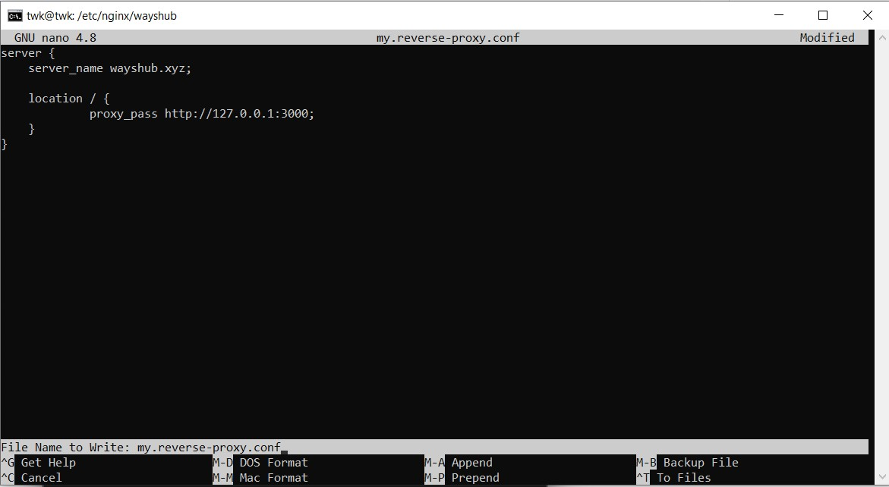


<p>3. Keluar dari directory wayshub kemudian masuk ke dalam file `nginx.conf`

Keluar dari directory

```
cd ..
```

edit file `nging.conf`

```
sudo nano nginx.conf
```

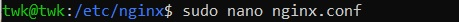

Scroll kebawah sampai menemukan include dan masukkan konfigurasi berikut:

```
include /etc/nginx/wayshub/*;
```

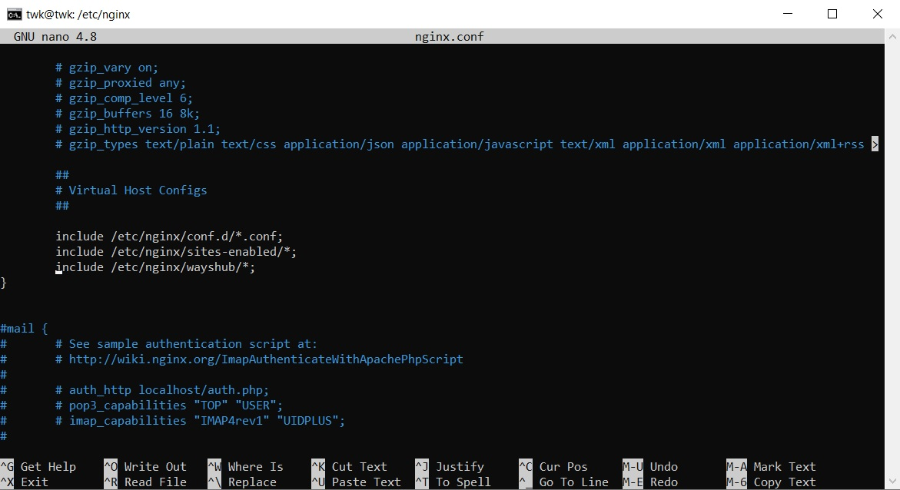

<p>4. Kemudian kita akan melakukan pengecekan konfigurasi dengan menjalankan perintah:

```
sudo nginx -t
```

<p>5. Restart nginx kita dengan perintah:

```
sudo systemctl restart nginx
```

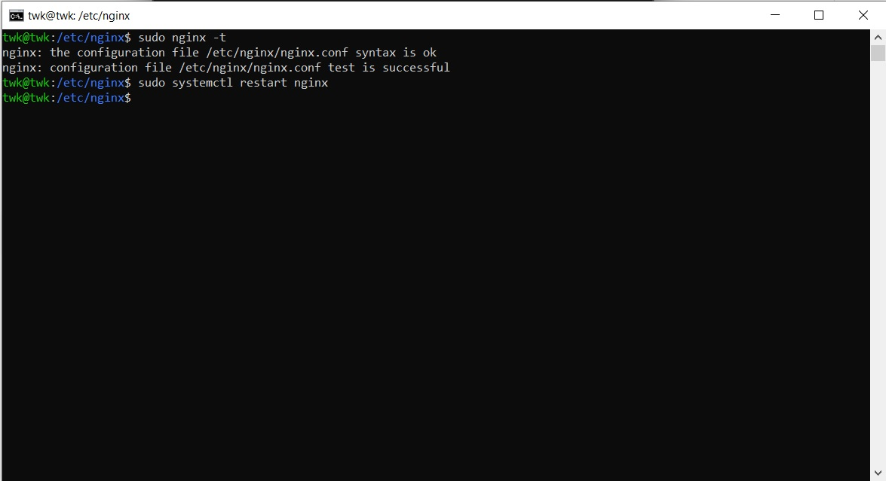

<p>6. Sekarang edit file host, karena saya menggunakan windows host ada di c:\Windows\System32\Drivers\etc\hosts

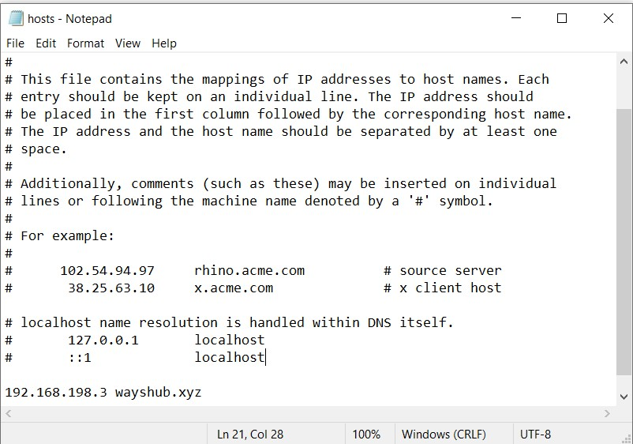

<p>7. Sekarang kita akan test apakah reverse proxy kita berhasil dengan mengecek di browser menggunakan domain

Jika muncul seperti gambar berikut artinya reverse proxy berhasil!

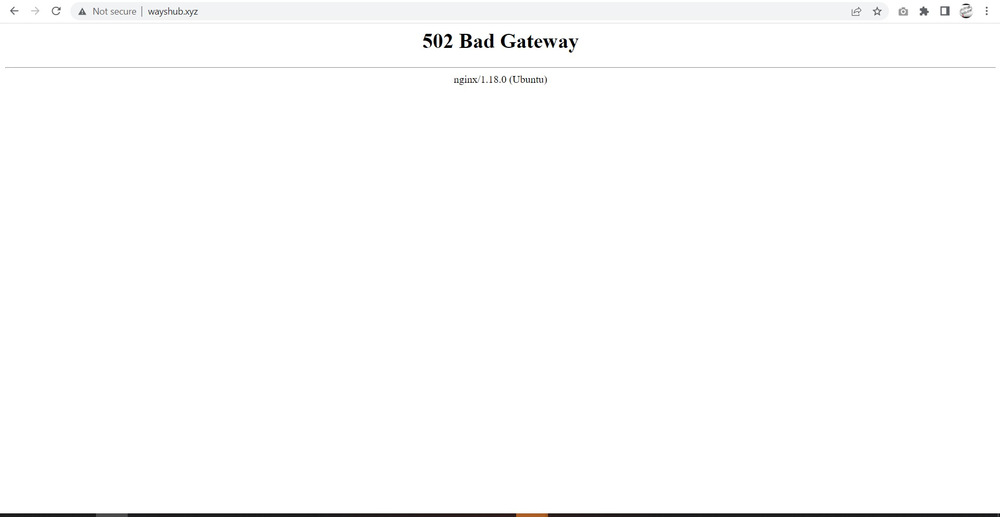

<p>8. Sekarang kita akan menjalankan aplikasi di domain kita

Dan berhasil!

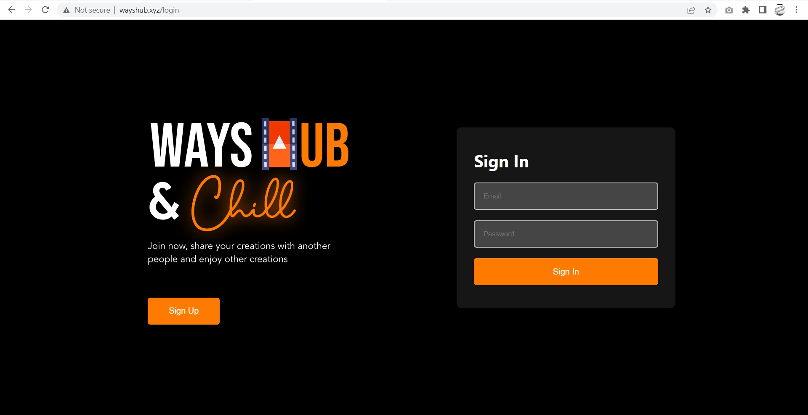

## Langkah 3 - Load Balancing

<p>1. Masuk ke dalam konfigurasi reverse proxy yang sudah kita buat sebelumnya kemudian edit seperti gambar berikut:

```
cd wayshub
```

```
sudo nano my.reverse-proxy.conf
```


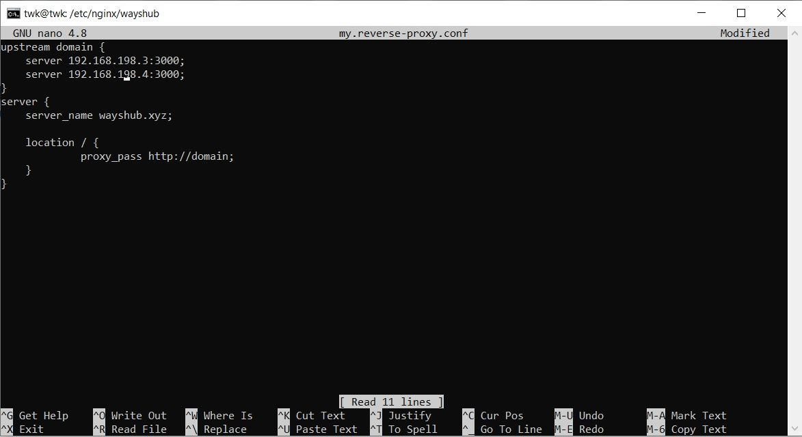

Keterangan:
- Pada bagian upstream kalian dapat mengganti nama domain dengan nama yang kalian inginkan.
- Pada bagian server masukan IP dari server kalian, setelah itu diikuti dengan port aplikasi.
- Selanjutnya pada bagian proxy_pass ubah dari yang sebelumnya adalah alamat IP dari aplikasi kalian, sekarang kalian samakan dengan nama upstream yang ada di konfigurasi kalian.

<p>2. Sekarang kita coba cek apakah konfigurasi yang sudah kita buat tadi itu error atau tidak dan restart nginx kita jika tidak ada error.

```
sudo nginx -t
```

```
sudo systemctl restart nginx
```


<p>3. Dan jalankan aplikasi kita di 2 server dengan perintah berikut:

``` 
yarn start
```

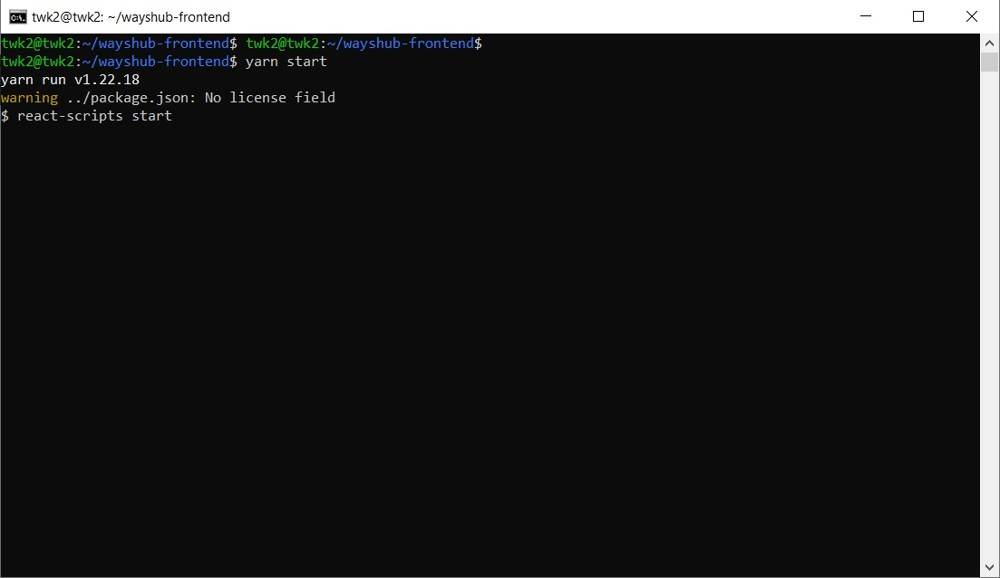

## Langkah 4 - Pengujian Load Balancing

<p>1. 2 server aktif menjalankan aplikasi

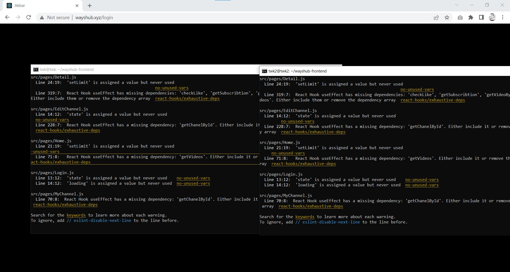

<p>2. Server twk tidak menjalankan aplikasi dan server twk2 menjalankan aplikasi

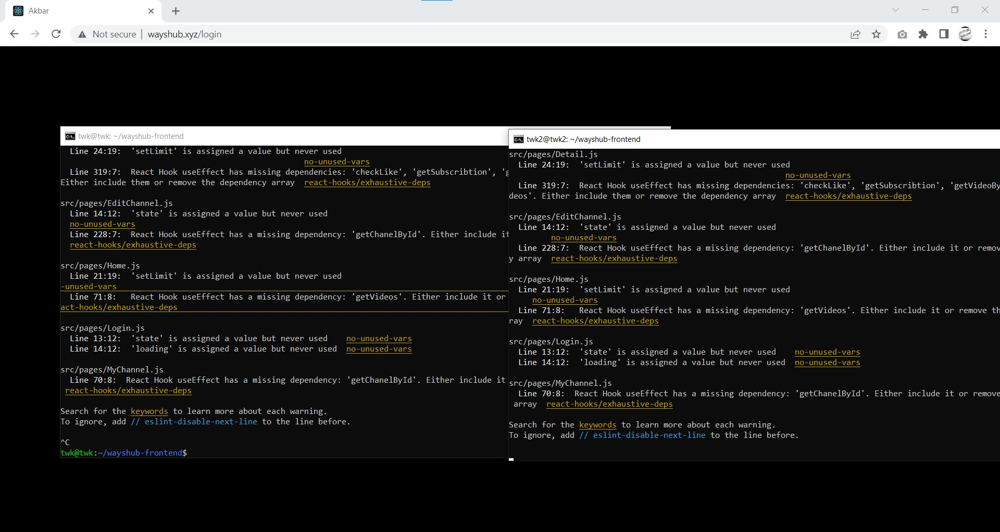

<p>3. Server twk menjalankan aplikasi dan server twk tidak menjalankan aplikasi

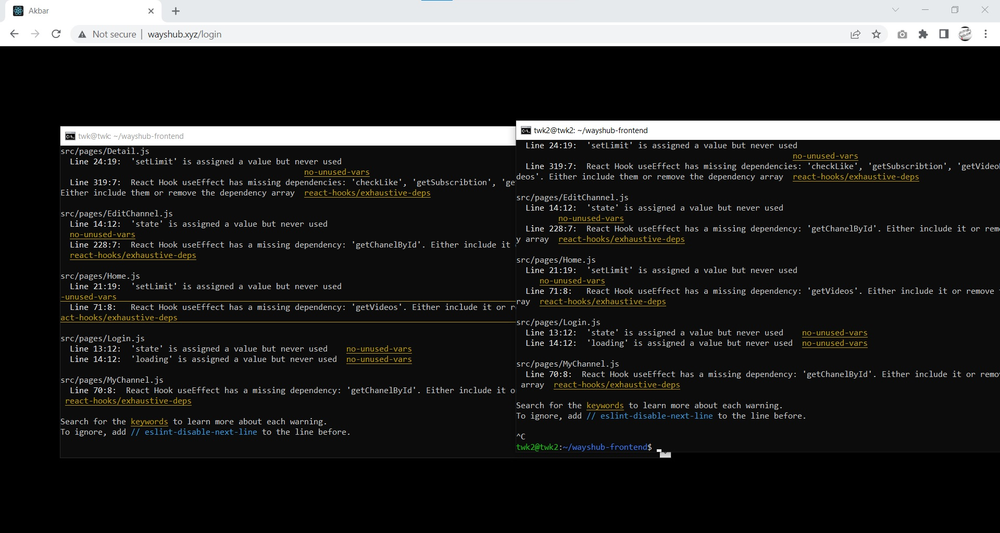

<p>4. Server twk dan twk2 tidak menjalankan aplikasi

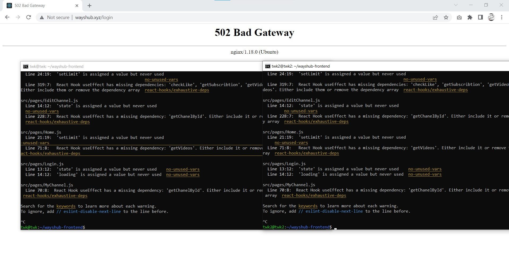
