# Install and Deploy Front End with Multipass

## Langkah 1 - Menginstall Multipass

1. Install package manager Snap agar kita bisa menginstall multipass menggunakan perintah berikut:
```
sudo apt install snapd
```
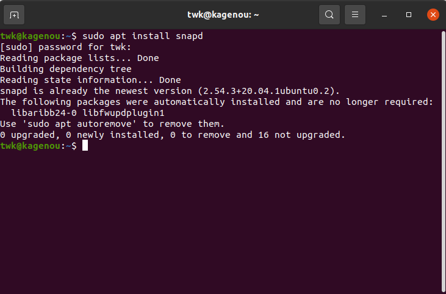

2. Setelah menginstall snapd barulah kita melakukan instalasi Multipass dengan perintah berikut:
```
sudo snap install multipass
```

Karna saya sudah menginstall multipass maka yang muncul adalah seperti berikut:

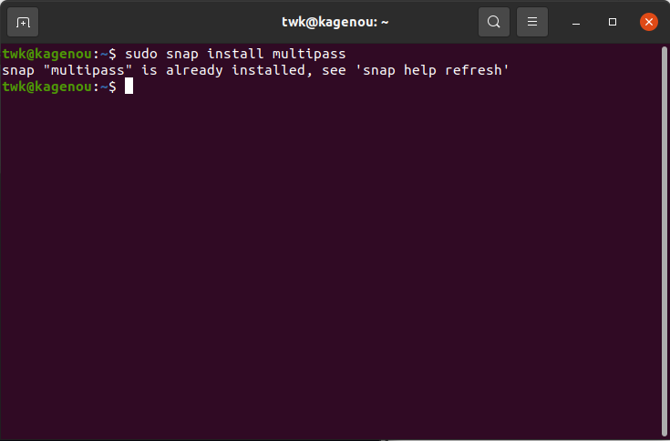

## Langkah 2 - Membuat virtual machine

1. Setelah menginstall multipass maka sekarang kita akan membuat sebuah virtual machine dengan perintah berikut:
```
multipass launch --name twk1 --cpus 2 --mem 2G
```
Perintah berikut akan membuat server dengan nama twk1 dengan spesifikasi cpu 2 core dan memori 2 GB, kalian dapat mengubah sesuai kebutuhan kalian
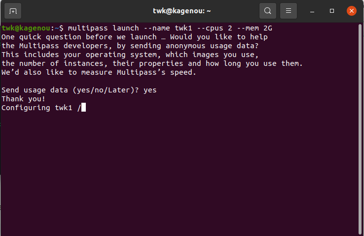

2. Untuk mengecek list server virtual machine yang telah kita buat dapat menggunakan perintah berikut:
```
multipass ls
```
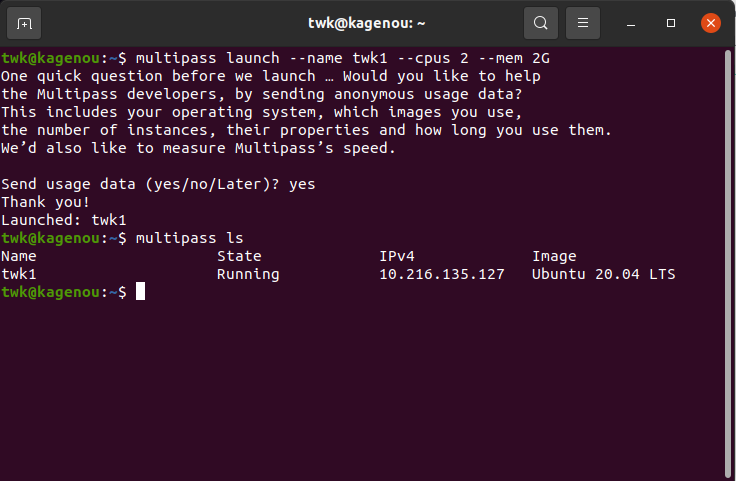

## Langkah 3 - Deploy aplikikasi, reverse proxy dan load balancing front end
1. Masuk kedalam virtual machine kita dengan menggunakan perintah berikut:
```
multipass shell twk1
```
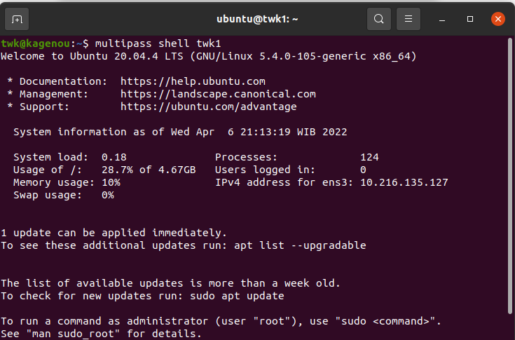

2. Sekarang kita akan menginstall NVM untuk aplikasi node kita

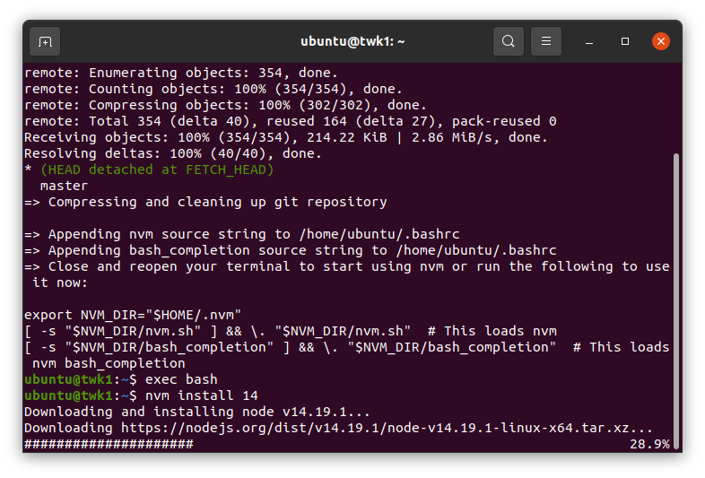

Dan clone aplikas front end


3. Sekarang kita masuk ke directory front end dan install node modules nya
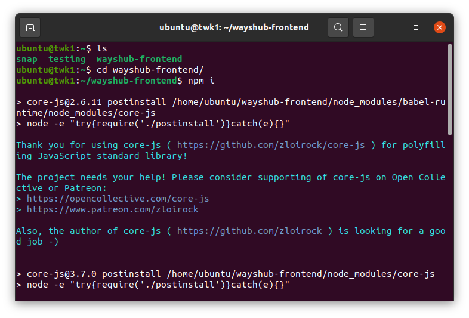

4. Sekarang kita pergi ke server 2 dan install nginx sebagai web server nya
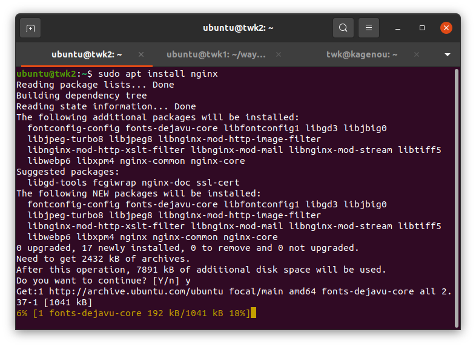

5. Buat directory dan file baru untuk konfigurasi load balancing dan reverse proxy seperti berikut:
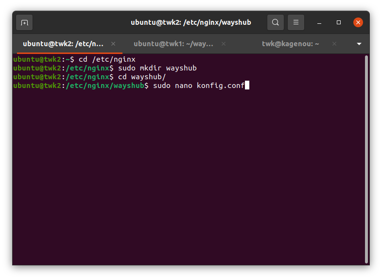

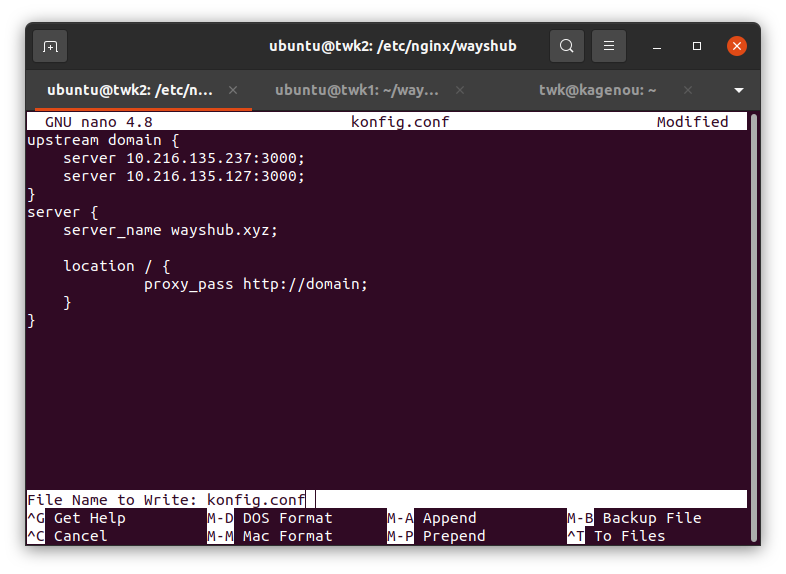

6. Masuk ke konfigurasi nginx dan tambahkan include folder kita tadi
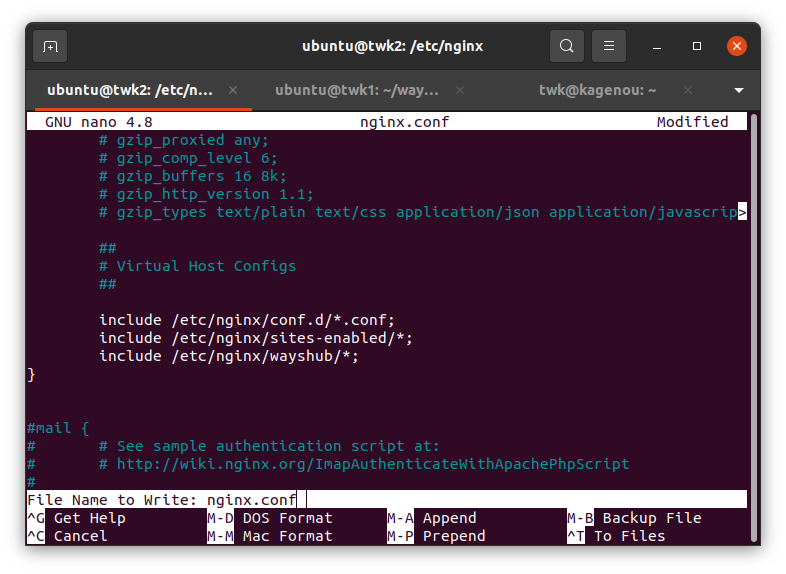

7. Test hasil konfigurasi kita tadi dan restart nginx nya 
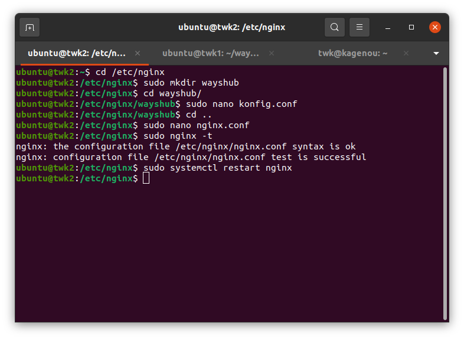

8. Masuk ke host local untuk membuat virtual domain agar kita bisa mengaksesnya
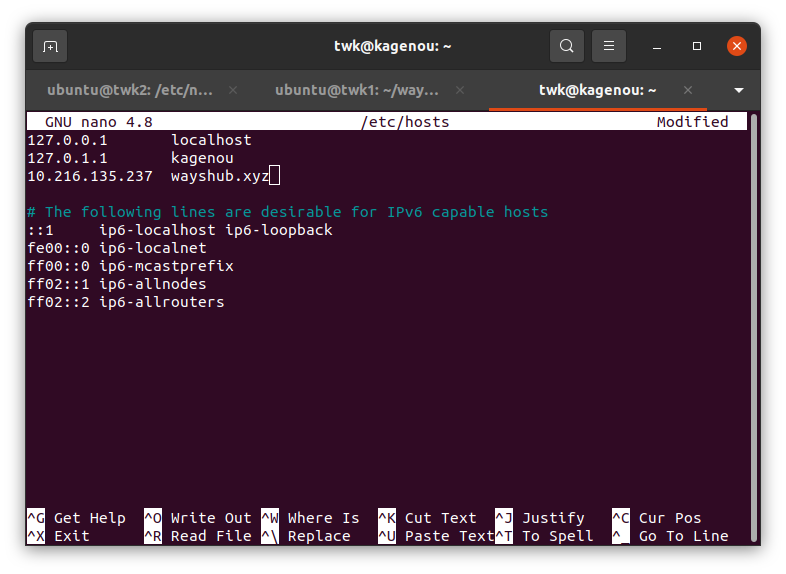

9. Install pm2 agar aplikasi dapat dijalankan secara daemon
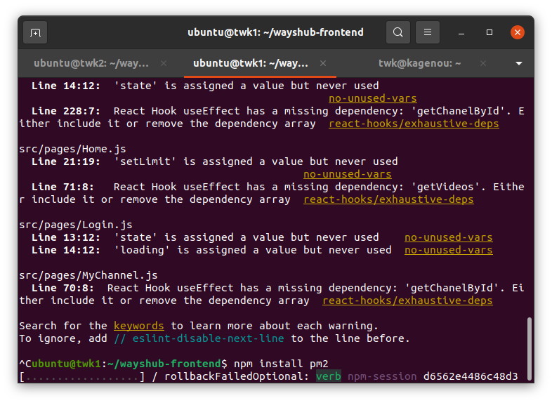

10. Start pm2 di kedua server kita
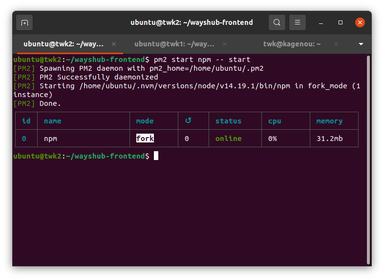

11. Berikut adalah hasil reverse proxy dan load balancing aplikasi front end kita
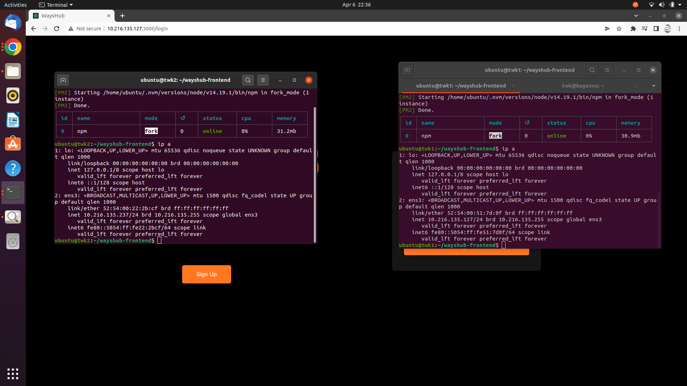


