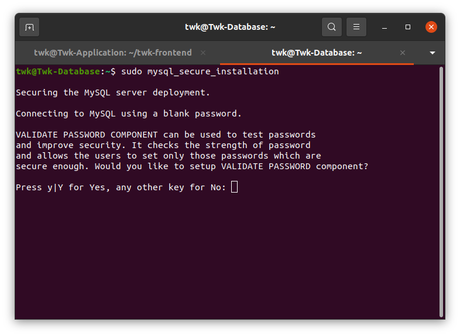
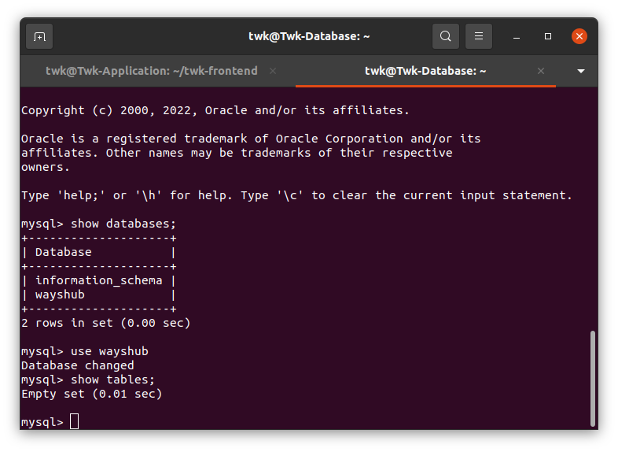

# Setup Frontend Backend with Database

## Langkah 1 - Clone Frontend and Backend

1. Clone Frontend dan Backend terlebih dahulu dan install dependencies dengan perintah berikut:

```
git clone https://github.com/dumbwaysdev/wayshub-frontend.git
```

```
git clone https://github.com/dumbwaysdev/wayshub-backend.git
```


```
curl -o- https://raw.githubusercontent.com/nvm-sh/nvm/v0.38.0/install.sh | bash
```


```
exec bash
```

```
nvm install 14
```


## Langkah 2 - Setting Database
1. Update dan upgrade terlebih dahulu server database kita

```
sudo apt update; sudo apt upgrade
```


2. Install mysql server

```
sudo apt install mysql-server
```


3. Cek status mysql kita

```
sudo systemctl status mysql
```


4. Lakukan pengamanan database agar database tidak bisa diakses oleh orang yang tidak berkepentingan

```
sudo mysq_secure_installation
```



5. Masuk kedalam mysql server dengan user default yaitu root dan password yang kita masukkan di langkah pengamanan step 4 tadi

```
sudo mysql -u root -p
```


11. Cek user kita

```
select user, host from mysql.user
```


12. Karena user untuk kita belum ada hanya ada user default yaitu root maka sekarang kita akan membuat user baru untuk kita

```
create user 'twk'@'%' IDENTIFIED BY 'Twk132109123';
```


kemudian buat database baru yaitu wayshub untuk aplikasi kita

```
create database wayshub;
```


lihat apakah database berhasil dibuat

```
show databases;
```


13. Berikan perijinan user kita untuk database wayshub

```
GRANT ALL PRIVILEGES ON wayshub.* to 'twk'@'%';
```


refresh setup perijinan kita

```
flush privileges;
```


14. Masuk kedalam mysql menggunakan user yang kita buat tadi dan cek apakah database wayshub sudah berhasil dibuat dan dapat diakses

```
mysql -u twk -p
```

```
show databases
```


15. Gunakan database wayshub dan show tables untuk melihat apakah kita berhasil menggunakan database wayshub

```
use wayshub;
```

```
show tables;
```



16. Sekarang kita akan men-setup bind addres agar hanya server tertentu yang dapat masuk ke dalam mysql server kita 

```
sudo nano /etc/mysql/mysql.conf.d/mysqld.cnf
```


17. Ubah di bagian bind address dan masukkan ip server aplikasi kita


Dan setting database selesai


## Langkah 3 - Setting Backend
1. Copy env.example dan buat menjadi file baru bernama .env


2. Masuk ke config.json untuk ubah ip nya ke mysql server kita yang gunanya agar dapat migrasi dan terhubung ke mysql server kita


Ubah sesuai credential mysql server kita tadi


3. Install sequelize untuk migrasi ke mysql server

```
npm install -g sequelize cli
```

catatan: Sequelize adalah sebuah ORM (Object Relationship Mapping) yang berbasis promise jadi secara tidak langsung ORM dapat bertindak sebagaimana database dapat memigrasi sebuah table maupun data dari backend ke server database yang telah kita buat, dan Sequelize dapat mendukung database berbasis SQL.

4. Lakukan migrasi

```
npx sequelize db:migrate
```


5. Sekarang kita pergi ke server database dan cek apakah sudah berhasil migrasi


## Langkah 4 - Setting Frontend
1. Pergi ke /src/config lalu ubah file api.js dan masukkan ip server backend kita agar front end kita terhubung ke backend


## Langkah 5 - PM2 Agar aplikasi berjalan secara daemon
1. Install terlebih dahulu pm2 

```
npm install pm2 -g
```


2. Buat ecosystem pm2 dan masukkan konfigurasi untuk aplikasi backend

```
pm2 ecosystem simple
```


3. Buat juga ecosystem di frontent seperti yang kita lakukan di backend tadi


3.Start pm2 di backend dan frontend


4. Uji backend di web browser


5. Uji frontend di web browse


6. Uji Pendaftaran dan login apakah front end dan back end sudah terintegrasi dengan baik


7. Unassign public ip database agar tidak ada yang bisa mengakses database kita
