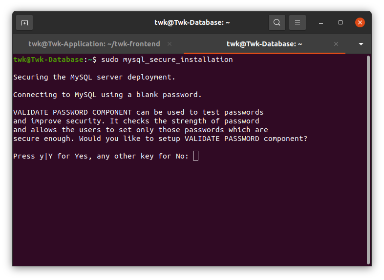

# Setup Frontend Backend with Database

## Langkah 1 - Instalasi and Config MYsql

1. Install mysql menggunakan perintah berikut:

```
sudo apt update; sudo apt upgrade
```

```
sudo apt install mysql*
```
Sekarang kita akan mengamankan server kita dengan menggunakan perintah berikut:

```
sudo mysql_secure_installation
```


