# Setup Docker dan Deploy Frontend, Backend dan Database

## Langkah 1 - Instalasi and Config Docker

1. Install Docker menggunakan bash dengan isi berikut:

```
sudo apt-get update
sudo apt-get install \
ca-certificates \
curl \
gnupg \
lsb-release
    
curl -fsSL https://download.docker.com/linux/ubuntu/gpg | sudo gpg --dearmor -o /usr/share/keyrings/docker-archive-keyring.gpg

echo \
"deb [arch=$(dpkg --print-architecture) signed-by=/usr/share/keyrings/docker-archive-keyring.gpg] https://download.docker.com/linux/ubuntu \
$(lsb_release -cs) stable" | sudo tee /etc/apt/sources.list.d/docker.list > /dev/null

sudo apt-get update
sudo apt-get install docker-ce docker-ce-cli containerd.io
```


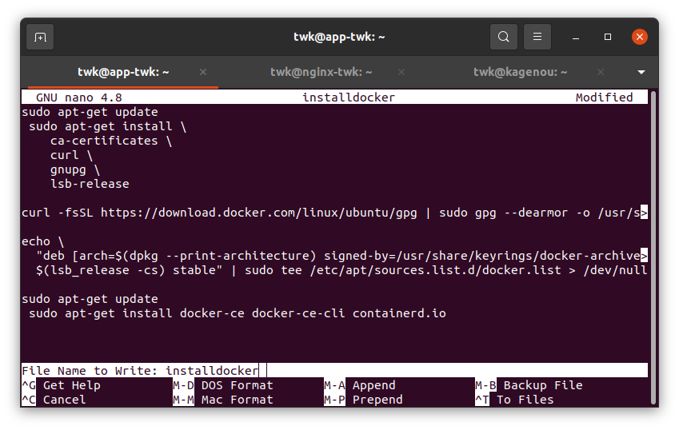

2. Cek versi docker menggunakan:
```
docker -v
```

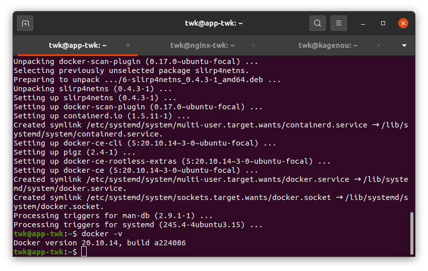

3. Kita akan membuat perintah docker agar tidak menggunakan sudo lagi dengan perintah berikut:

```
sudo usermod -aG docker twk
```

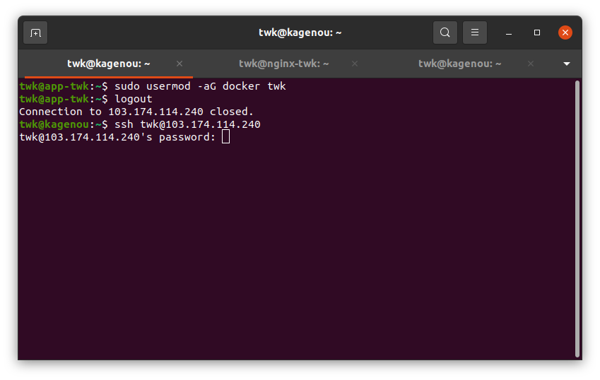

4. Sekarang kita login menggunakan:

```
docker login
```


## Langkah 2 - Docker Images
1. Sekarang kita mendownload node versi dubnium alpine 3.11 dan mysql dengan tag latest

```
docker pull node:dubnium-alpine3.11
```

```
docker pull mysql
```


2. Sekarang kita cek images apakah sudah berhasil di pull dengan:

```
docker images
```
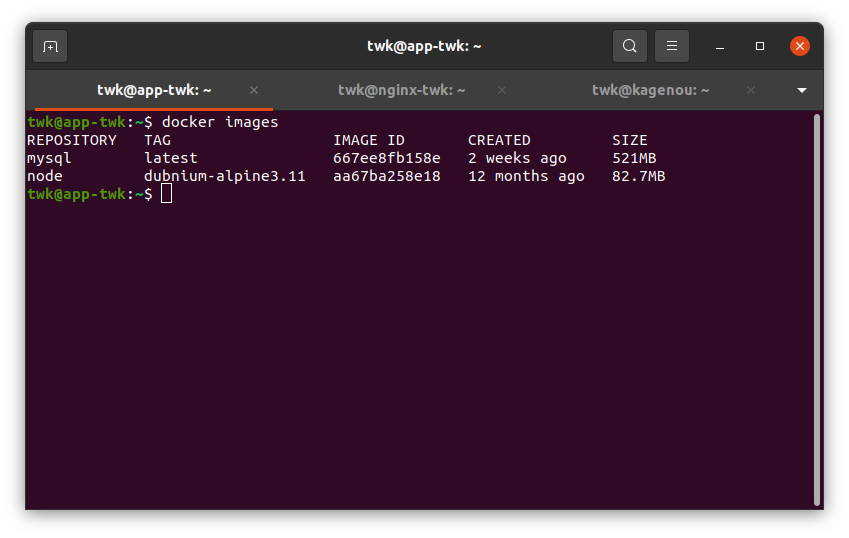

## Langkah 3 - Setup Frontend Backend

1. Sekarang saya clone front end dan back end nya 


2. Sekarang saya akan run images mysql dan membuat volume dengan directory mysql-data

```
docker run -d --name database -p 3306:3306 -v ~/mysql-data:/var/lib/mysql -e MYSQL_ROOT_PASSWORD=*Password* -e MYSQL_DATABASE=*namadatabase* mysql:latest
```

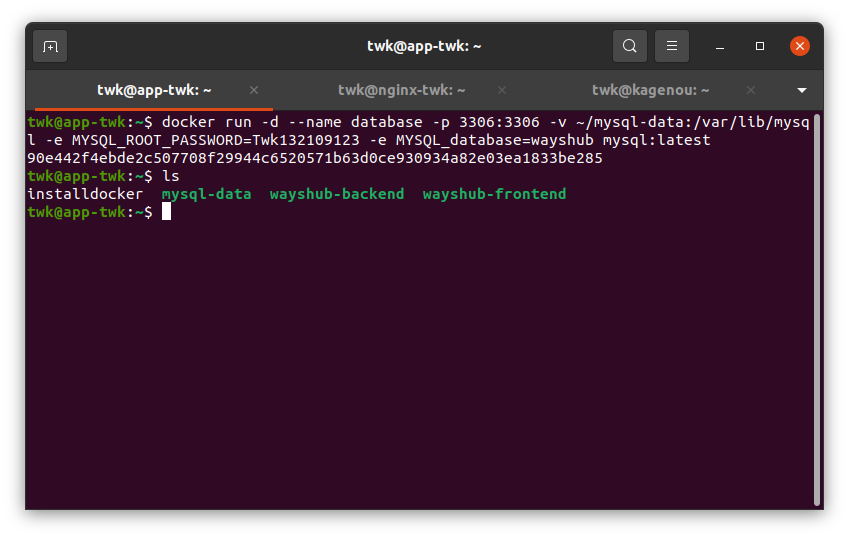

3. Sekarang saya akan mengkonfigurasi backend nya dengan membuat docker compose


Install terlebih dahulu docker compose

```
sudo curl -L "https://github.com/docker/compose/releases/download/1.29.2/docker-compose-$(uname -s)-$(uname -m)" -o /usr/local/bin/docker-compose
```

```
sudo chmod +x /usr/local/bin/docker-compose
```

```
docker compose --version
```


4. Masuk ke directory backend dan copy env.example menjadi .env

Karna disini saya sudah mempunyai .env maka disini saya hanya memperlihatkan isinya

```
nano .env
```


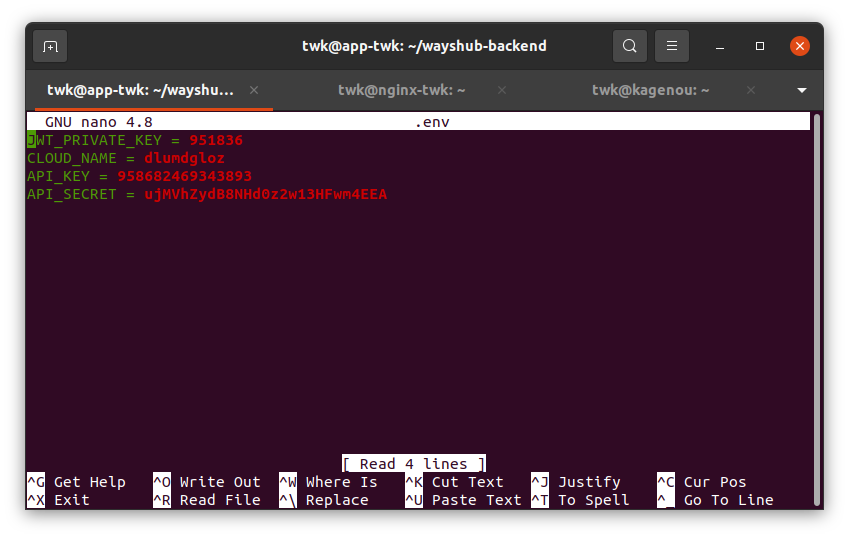

5. Sekarang konfigurasi backend ke database dengan cara:

Masuk ke directory config dan edit file config.json

```
nano config.json
```


6. Kembali ke folder backend dan buat file bernama dockerfile berisi:

```
FROM node:dubnium-alpine3.11
WORKDIR /usr/app
COPY . .
RUN npm install
RUN npm install sequelize-cli -g
RUN npx sequelize db:migrate
EXPOSE 5000
CMD [ "npm", "start" ]
```

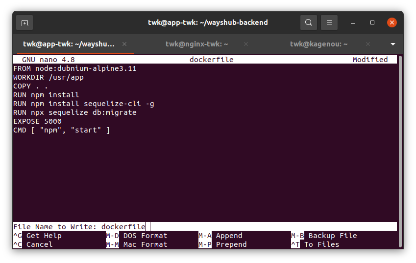

7. Sekarang buat file docker-compose.yml dengan isi berikut:

```
version: '3.7'
services:
 backend:
   build: .
   container_name: be
   image: twkakbar/wayshub-be:stable
   stdin_open: true
   ports:
    - 5555:5000
```
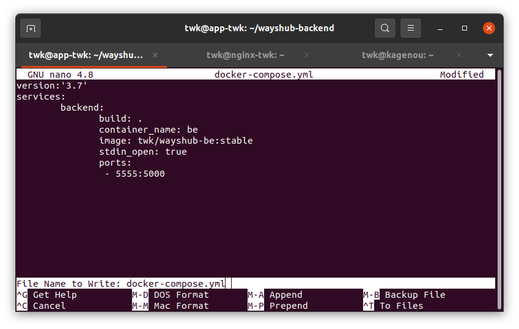

8. Build dan Jalankan compose secara daemon dengan:

```
docker-compose up -d
```

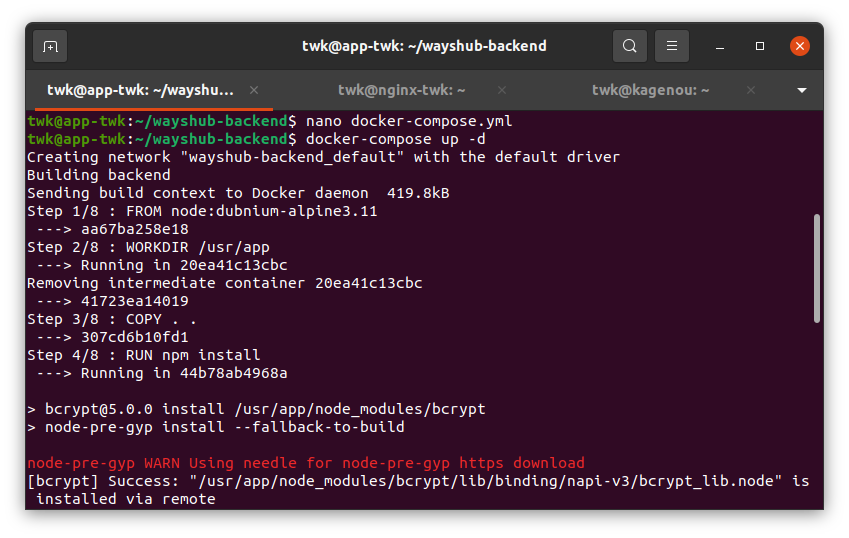

9. Jika sudah running tes di web browser dengan masukkan ip dan custom port tadi

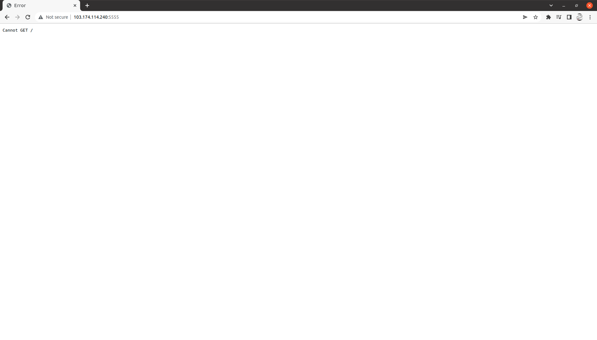

10. Jika back end sudah selesai sekarang kita akan ke front end dan mengkonfigurasi front end sebelum membuat compose

Edit api.js di directory syc/config untuk mengkoneksikan ke back end nya

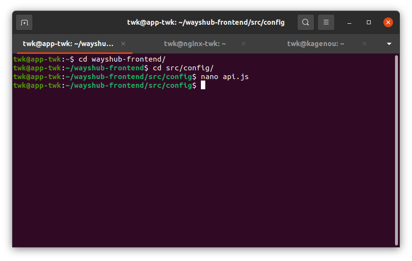

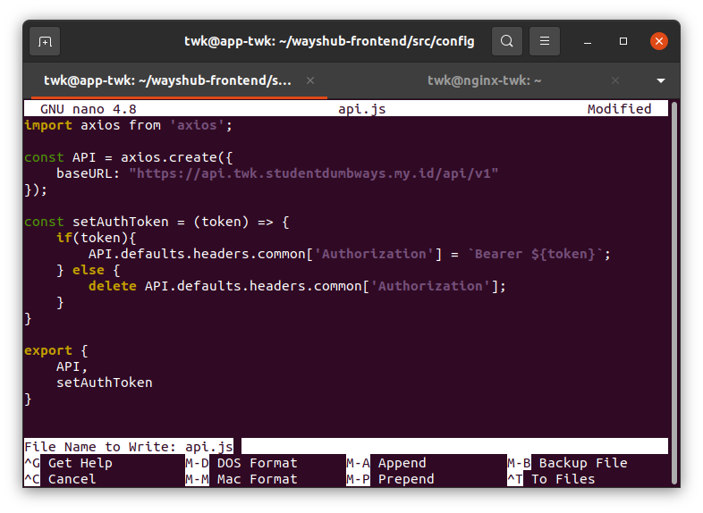

11. Sekarang kita akan buat file dockerfile seperti di backend tadi dengan isi:

```
FROM node:dubnium-alpine3.11
WORKDIR /usr/app
COPY . .
RUN npm install
EXPOSE 3000
CMD [ "npm", "start" ]
```


12. Buat file docker-compose.yml untuk front end dengan isi:

```
version: '3.7'
services:
 frontend:
   build: .
   container_name: fe
   image: twkakbar/wayshub-fe:stable
   stdin_open: true
   ports:
    - 3333:3000
```

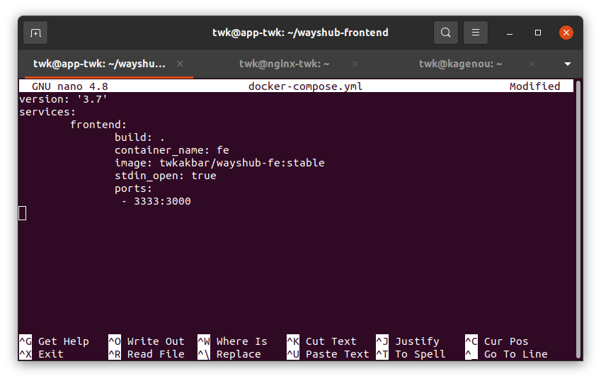

13. Build dan Jalankan compose secara daemon dengan:

```
docker-compose up -d
```


14. Sekarang kita cek di web browser

```

```

## Langkah 4 - Setup Gateway
1. Sekarang kita akan mengkonfigurasi gateaway nya dengan reverse proxy

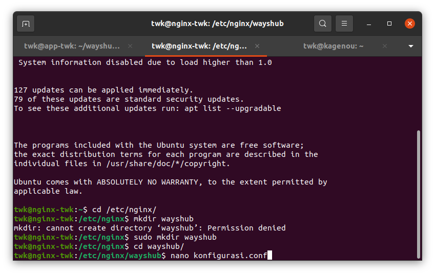

2. Masukkan konfigurasi reverse proxy untuk link domain twk.studentdumbways.my.id


3. Masukkan konfigurasi reverse proxy untuk link domain api.twk.studendumbways.my.id


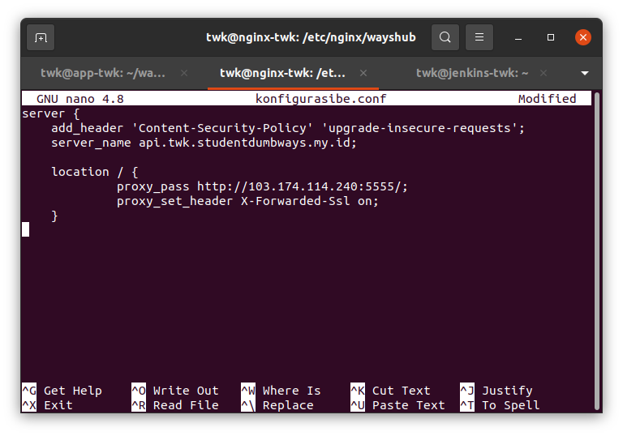

4. Sekarang konfigurasi nginx.conf agar konfigurasi kita tadi terbaca oleh nginx

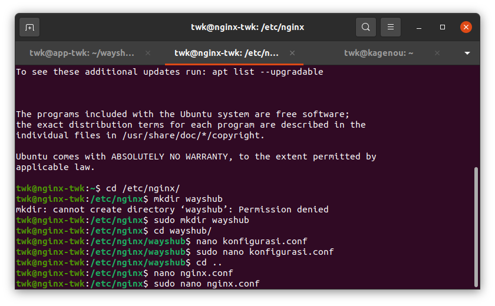

5. Tambahkan include folder wayshub tadi

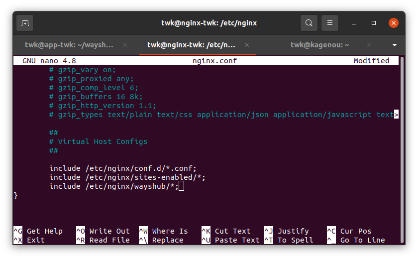

6. Verifikasi hasil konfig dan restart nginx

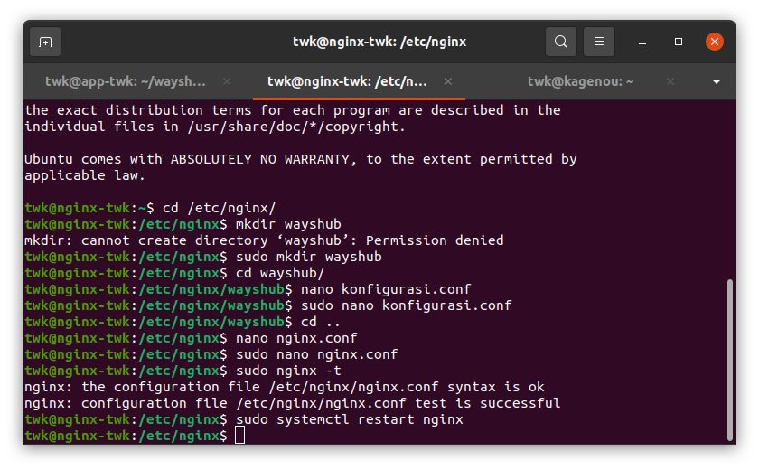

7. Sekarang kita akan membuat SSL menggunakan certbot agar domain kita menjadi https dengan cara:

Install terlebih dahulu certbot nya

```
sudo snap install --classic certbot
```

```
sudo ln -s /snap/bin/certbot /usr/bin/certbot
```

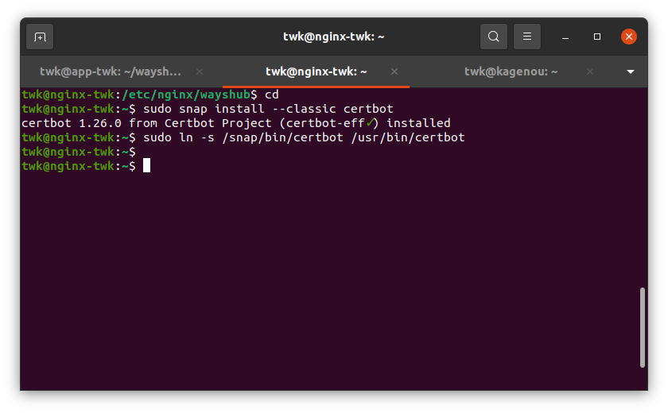

8. Sekarang kita akan membuat folder baru yaiut .secrets dan membuat file twk.ini dan masukkan private key cloudflare kita


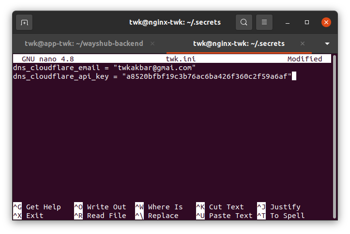

9. Sekarang jalankan certbot menggunakan perintah:

```
sudo certbot --nginx
```

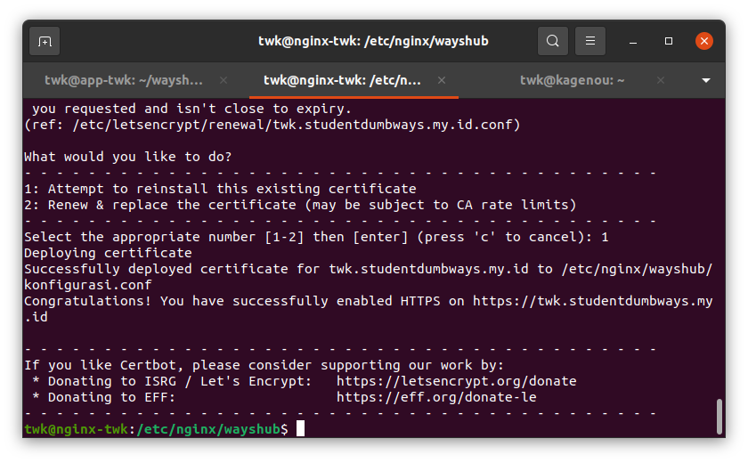

10. Sekarang kita cek apakah sudah berhasil HTTPS atau belum

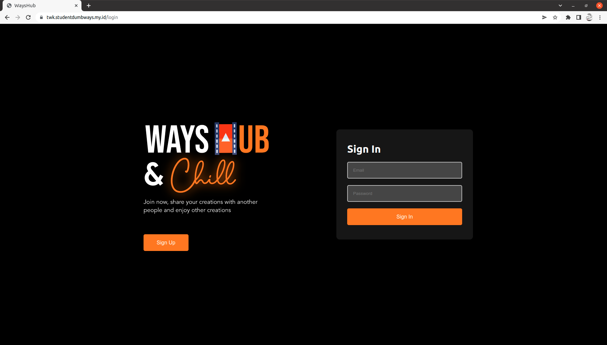


