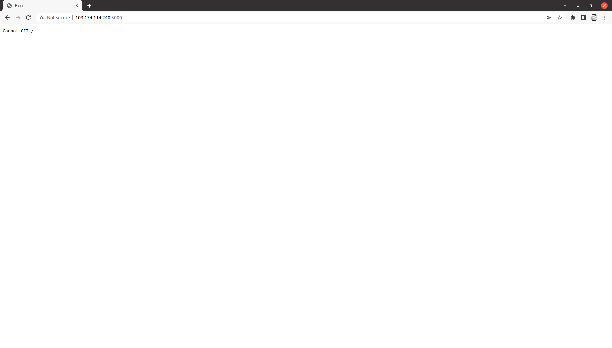

# Docker Swarm

## Langkah 1 - Inisiasi Server Manajer dan Join

1. Lakukan instalasi docker dan docker compose pada server manajer dan server worker kalian terlebih dahulu seperti [di sini](https://github.com/twkakbar/pelatihan/blob/main/week%203/day%201%20-%20Docker%20and%20deploy/setup-docker-frontend-backend.md)

2. Jika sudah melakukan instalasi docker dan docker compose lalu inisiasi server manajer dengan perintah berikut:

```
docker swarm init --addvertise-addr (IP server)
```


3. Join server worker kalian ke server manajer dengan perintah yang diberikan di step 2, copy dan jalankan di server worker kalian

Join server worker 1


Join server worker 2


4. Untuk memeriksa apakah worker sudah join ke server manager gunakan perintah berikut:

```
docker node ls
```


## Langkah 2 - Docker Swarm Commands

1. Untuk membuat docker service gunakan perintah berikut:

```
docker service create --replicas 1 --name helloworld alpine ping google.com
```


2. Untuk scale aplikasi gunakan perintah berikut:

```
docker service scale helloworld=5
```


Maka service akan di scaling sebanyak 5

3. Untuk melihat konfigurasi container gunakan perintah berikut:

```
docker service inspect helloworld
```


4. Untuk me-remove service gunakan perintah berikut:

```
docker service rm helloworld
```


## Langkah 3 - Docker Swarm Deploy

1. Git clone terlebih dahulu aplikasi frontend dan backend

```
https://github.com/dumbwaysdev/dumbflix-frontend.git
```

```
https://github.com/dumbwaysdev/dumbflix-backend.git
```


Untuk konfigurasi dari Dockerfile dan docker-compose.yml seperti berikut:

Frontend

```
FROM node:dubnium-alpine3.11
WORKDIR /usr/src/app
COPY ..
RUN npm install
EXPOSE 3000
CMD [ "npm", "start" ]
```

Backend

```
FROM node:dubnium-alpine3.11
WORKDIR /usr/src/app
COPY . .
RUN npm install
RUN npm install sequelize-cli -g
RUN npx sequelize db:migrate
EXPOSE 5000
CMD [ "npm", "start" ]
```

Docker compose

```
version: '3.7'
services: 
 frontend:
   container_name: twk-fe
   build: .
   image: fe:1.0
   stdin_open: true
   ports:
    - 3333:3000
 Backend:
   container_name: twk-be
   build: .
   image: be:1.0
   stdin_open: true
   ports:
    - 5000:5000
```

2. Jalankan database mysql

```
docker run -d --name database -p 3306:3306 -v ~/mysql-data:/var/lib/mysql -e MYSQL_ROOT_PASSWORD=*Password* -e MYSQL_DATABASE=*namadatabase* mysql:latest
```


3. Setelah selesai melakukan build dan menjalankan container database. Selanjutnya masuk ke dalam directory dumbflix-frontend setelah itu jalankan perintah berikut:

```
docker stack deploy --compose-file docker-compose.yml (name service)
```


4. Untuk melihat aplikasi yang telah kita deploy menggunakan docker swarm, gunakan perintah berikut:

```
docker service ls
```


5. Sekarang kita coba untuk melakukan Scaling aplikasi backend menggunakan perintah berikut:

```
docker service scale (service id)=(jumlah yang di inginkan)
```


6. Hasil scaling


Hasil backend



Hasil frontend


Status scale


