# Setup Kubernetes dan Deploy Microservices

## Langkah 1 - Install dan Setup Kubernetes

1. Nonaktifkan Firewall

```
ufw disable
```

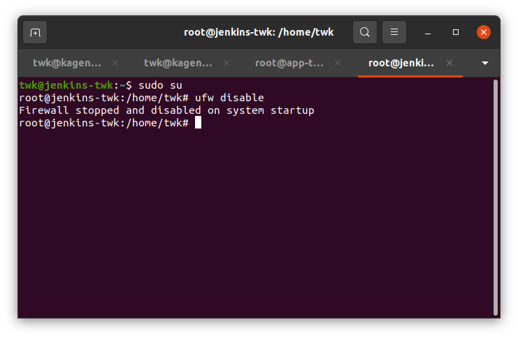

2. Nonaktifkan swap

```
swapoff -a; sed -i '/swap/d' /etc/fstab
```

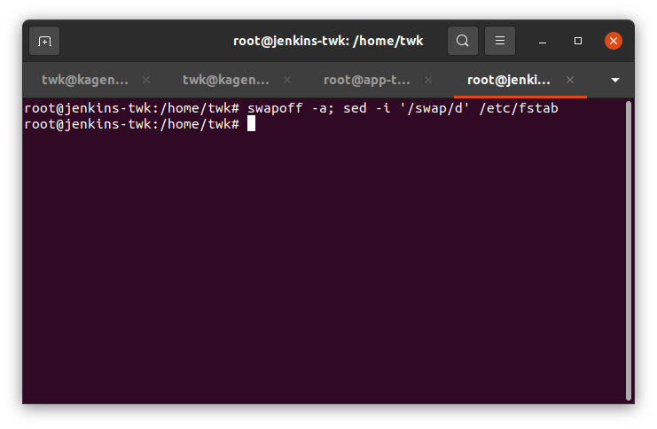

3. Update kernel system

```
cat >>/etc/sysctl.d/kubernetes.conf<<EOF
net.bridge.bridge-nf-call-ip6tables = 1
net.bridge.bridge-nf-call-iptables = 1
EOF
```

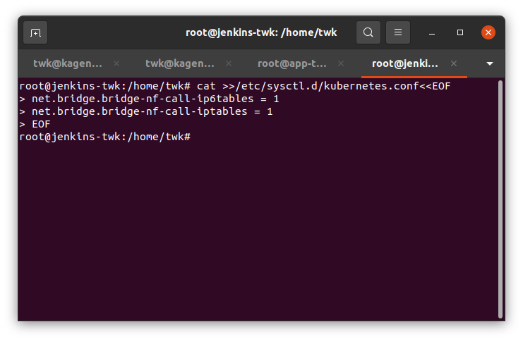

Kemudian restart 

```
sysctl --system
```

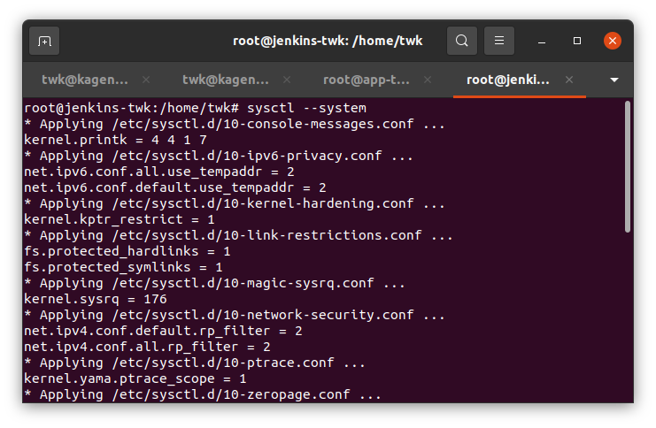

4. Install docker dan docker compose

```
wget -O - https://gist.githubusercontent.com/sgnd/8ac5130ec4439985d14d118c77b7b418/raw/c351376fd4d7afbca587f8ed1f2fd57f87e113ce/docker.sh | bash
```

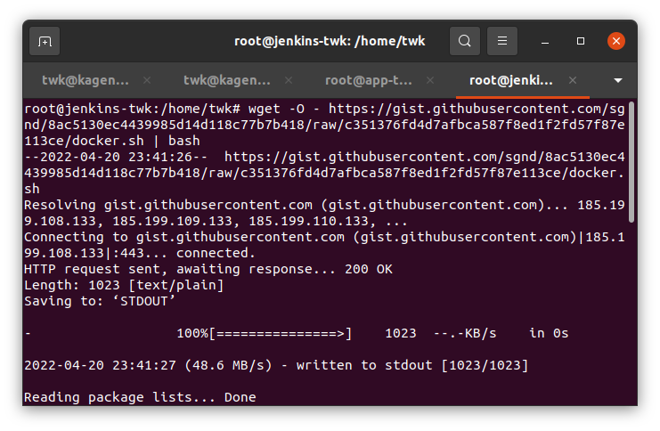

5. Konfigurasi docker

```
cat <<EOF | sudo tee /etc/docker/daemon.json
{
"exec-opts": ["native.cgroupdriver=systemd"],
"log-driver": "json-file",
"log-opts": {
"max-size": "100m"
},
"storage-driver": "overlay2"
}
EOF
```

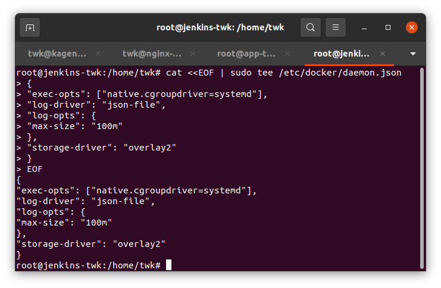

Lalu restart docker

```
sudo systemctl enable docker
sudo systemctl daemon-reload
sudo systemctl restart docker
```

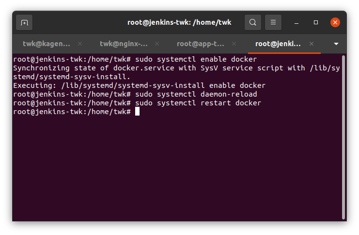

6. Instalasi Kubernetes

```
sudo apt -y install curl apt-transport-https
curl -s https://packages.cloud.google.com/apt/doc/apt-key.gpg | sudo apt-key add -
echo "deb https://apt.kubernetes.io/ kubernetes-xenial main" | sudo tee /etc/apt/sources.list.d/kubernetes.list
sudo apt update -y; sudo apt -y install kubelet kubeadm kubectl
```

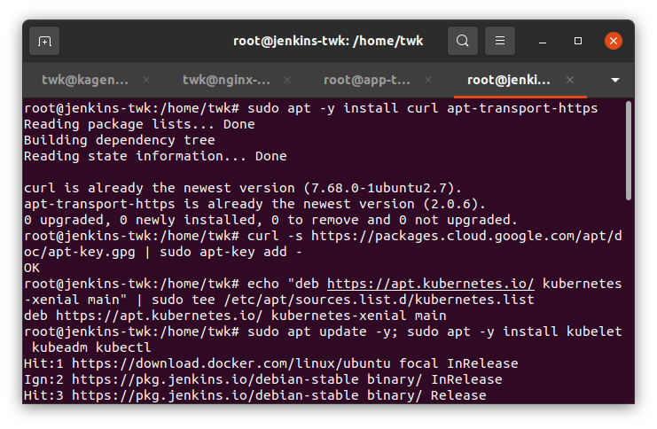

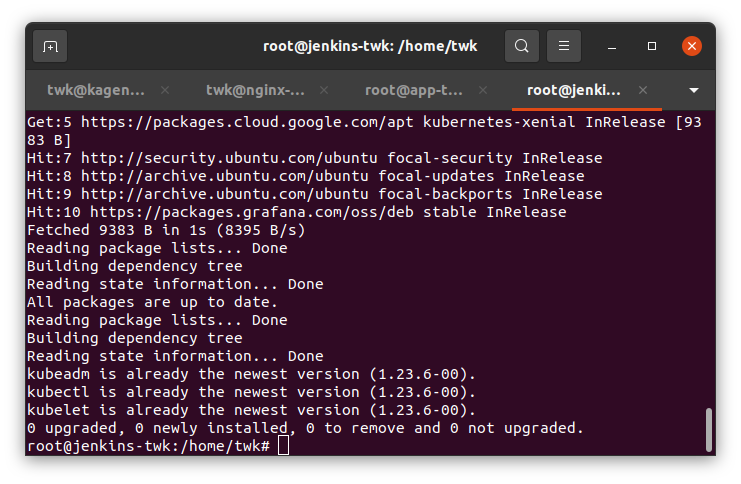

7. Konfigurasi kubeadm untuk menginisiasi server manager

```
sudo kubeadm init --apiserver-advertise-address=`103.176.78.20` --pod-network-cidr=192.168.0.0/16  --ignore-preflight-errors=all
```

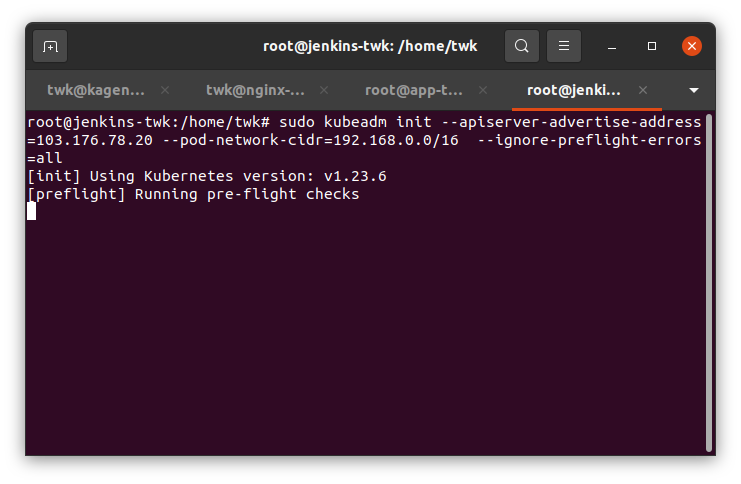

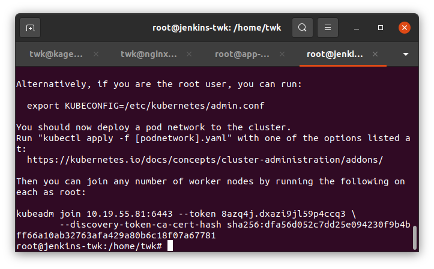

8. Konfigurasi kubernetes agar dapat menjalankan perintah

```
mkdir -p $HOME/.kube
sudo cp -i /etc/kubernetes/admin.conf $HOME/.kube/config
sudo chown $(id -u):$(id -g) $HOME/.kube/config
```

9. Instalasi CNI Calico

```
kubectl --kubeconfig=/etc/kubernetes/admin.conf create -f https://projectcalico.docs.tigera.io/manifests/calico.yaml
```

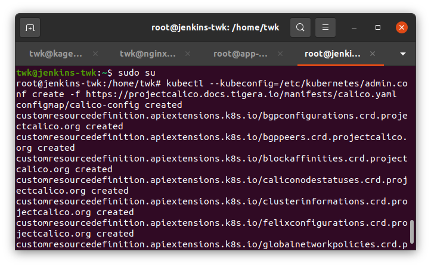

10. Cek semua pods apakah calico sudah berhasil di install

```
kubectl get pods --all-namespaces
```

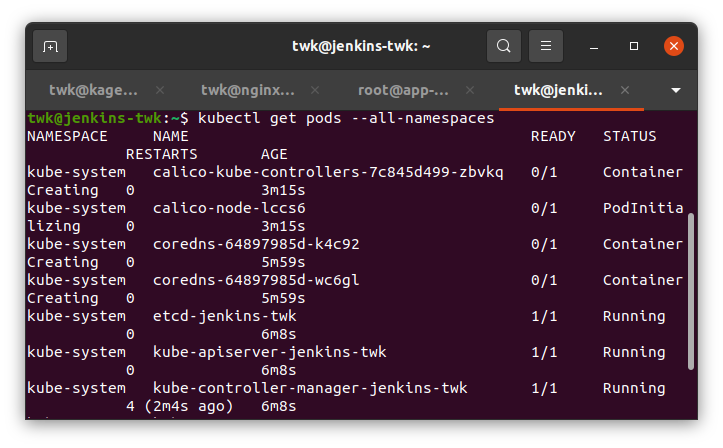

11. Lakukan join cluster dengan perintah berikut:

```
kubeadm token create --print-join-command
```

Lalu copy hasil output berikut ke server worker 1 dan 2

```
kubeadm join *****
```

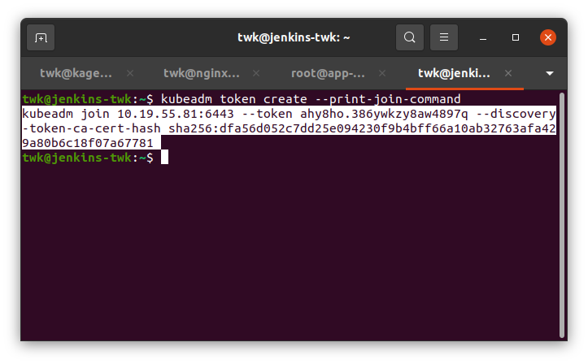

Join server worker 1 (nginx-twk)

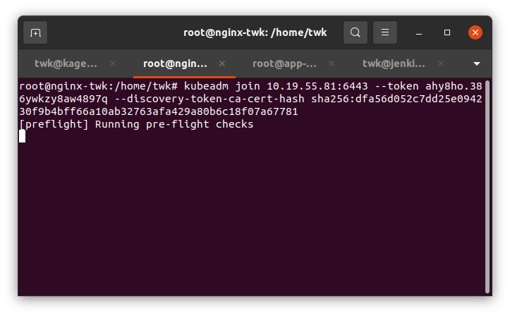

Join server worker 2 (app-twk)

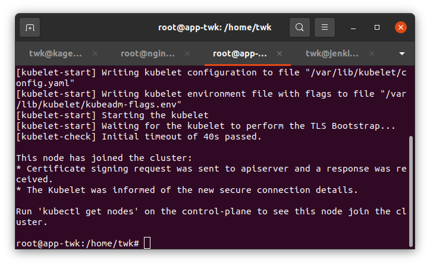

Cek koneksi nya apakah sudah terkoneksi dengan cluster menggunakan perintah:

```
kubectl get nodes
```

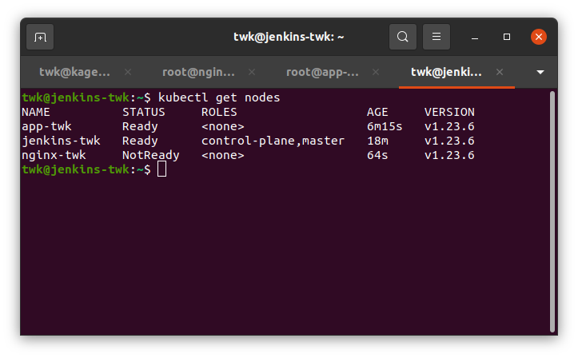

12. Deploy nginx, create terlebih dahulu

```
kubectl create deploy nginx --image nginx
```

Kemudian jika sudah berhasil di build maka jalankan

```
kubectl expose deploy nginx --port 80 --type NodePort
```

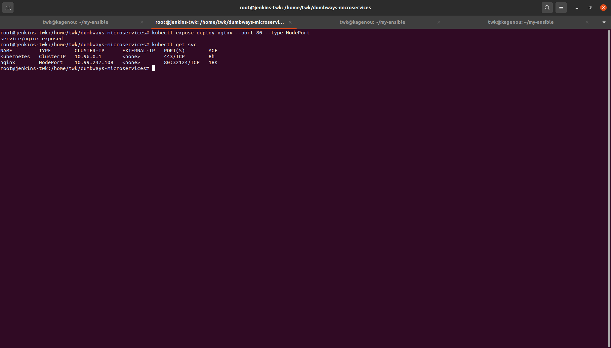

Mengecek service

```
kubectl get svc
```

13. Clone aplikasi microservices

```
git clone https://github.com/dumbwaysdev/dumbways-microservices.git
```

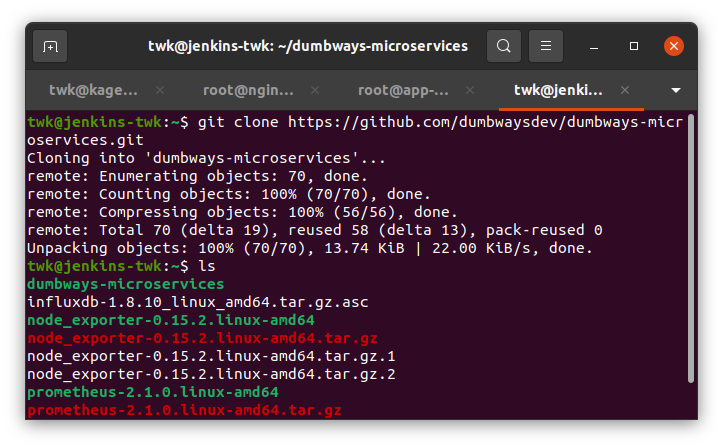

14. Masuk ke directory aplikasi microservices dan edit docker-compose dan kubernetes.yml nya

Untuk docker compose saya seperti berikut:

```
version: '3'

services:
    mongo:
        image : mongo
        container_name: mongo
        environment:
        - PUID=1000
        - PGID=1000
        volumes:
        - /home/twk/mongo/database:/data/db
        ports:
        - 27017:27017
        restart: unless-stopped

    todo-profile:
        build: ./profile
        command: "ts-node /app/src/server"
        image: twkakbar/todo-profile
        restart: always
        container_name: todo-profile
        ports:
        - 5001:5001

    todo-services:
        build: ./services
        command: "node /app/src/server.js"
        image: twkakbar/todo-services
        restart: always
        container_name: todo-services
        ports:
        - 4000:4000

    todo-skill:
        build: ./skill
        command: "ts-node /app/src/server"
        image: twkakbar/todo-skill
        restart: always
        container_name: todo-skill
        ports:
        - 5000:5000

    todo-todo:
        build: ./todo
        command: "ts-node /app/src/server"
        image: twkakbar/todo-todo
        restart: always
        container_name: todo-todo
        ports:
        
    todo-user:
        build: ./user
        command: "ts-node /app/src/server"
        image: twkakbar/todo-user
        restart: always
        container_name: todo-user
        ports:
        - 7000:7000
```

Untuk kubernetes.yml saya seperti berikut:

```
apiVersion: apps/v1
kind: Deployment
metadata:
  name: todo-profile
spec:
  selector:
    matchLabels:
      app: todo-profile
  replicas: 1 # tells deployment to run 2 pods matching the template
  template:
    metadata:
      labels:
        app: todo-profile
    spec:
      containers:
      - name: todo-profile
        image: twkakbar/todo-profile
        ports:
        - containerPort: 5001
        command: ["/bin/sh"]
        args: ["-c", "while true; do echo hello; sleep 10;done"]
---
apiVersion: apps/v1
kind: Deployment
metadata:
  name: todo-services
spec:
  selector:
    matchLabels:
      app: todo-services
  replicas: 1 # tells deployment to run 2 pods matching the template
  template:
    metadata:
      labels:
        app: todo-services
    spec:
      containers:
      - name: todo-services
        image: twkakbar/todo-services
        ports:
        - containerPort: 4000
        command: ["/bin/sh"]
        args: ["-c", "while true; do echo hello; sleep 10;done"]
---
apiVersion: apps/v1
kind: Deployment
metadata:
name: todo-skill
spec:
  selector:
    matchLabels:
      app: todo-skill
  replicas: 1 # tells deployment to run 2 pods matching the template
  template:
    metadata:
      labels:
        app: todo-skill
    spec:
      containers:
      - name: todo-skill
        image: twkakbar/todo-skill
        ports:
        - containerPort: 5000
        command: ["/bin/sh"]
        args: ["-c", "while true; do echo hello; sleep 10;done"]
---
apiVersion: apps/v1
kind: Deployment
metadata:
  name: todo-todo
spec:
  selector:
    matchLabels:
      app: todo-todo
  replicas: 1 # tells deployment to run 2 pods matching the template
  template:
    metadata:
labels:
        app: todo-todo
    spec:
      containers:
      - name: todo-todo
        image: twkakbar/todo-todo
        ports:
        - containerPort: 5002
        command: ["/bin/sh"]
        args: ["-c", "while true; do echo hello; sleep 10;done"]
---
apiVersion: apps/v1
kind: Deployment
metadata:
  name: todo-user
spec:
  selector:
    matchLabels:
      app: todo-user
  replicas: 1 # tells deployment to run 2 pods matching the template
  template:
    metadata:
      labels:
        app: todo-user
    spec:
      containers:
      - name: todo-user
        image: twkakbar/todo-user
        ports:
        - containerPort: 7000
        command: ["/bin/sh"]
        args: ["-c", "while true; do echo hello; sleep 10;done"]
---
apiVersion: apps/v1
kind: Deployment
metadata:
  name: mongo
spec:
  selector:
    matchLabels:
      app: mongo
  replicas: 1 # tells deployment to run 2 pods matching the template
template:
    metadata:
      labels:
        app: mongo
    spec:
      containers:
      - name: mongo
        image: mongo
        ports:
        - containerPort: 27017
```

15. Sekarang login terlebih dahulu ke docker hub

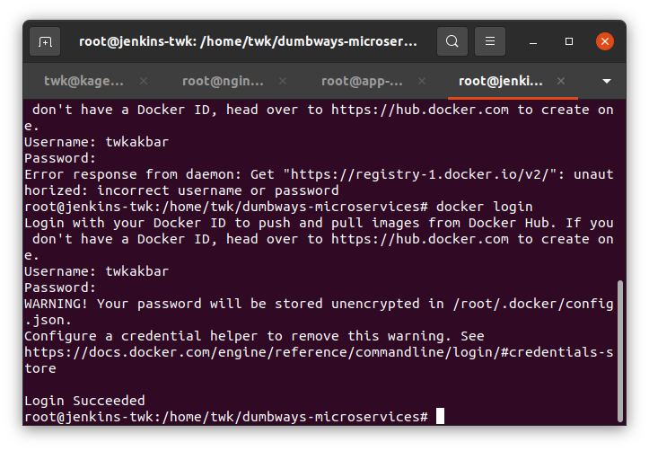

16. Build docker compose

```
docker-compose build
```

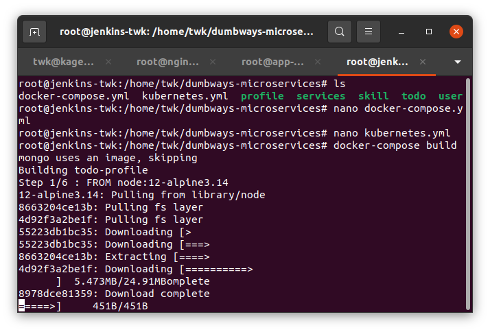

17. Jika sudah selesai di build sekarang push ke dockerhub

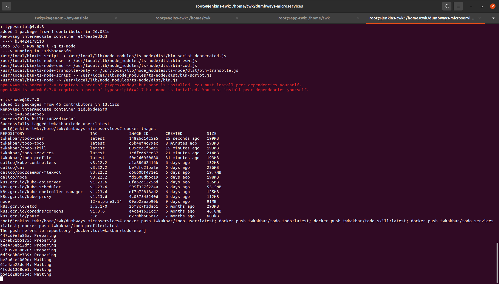

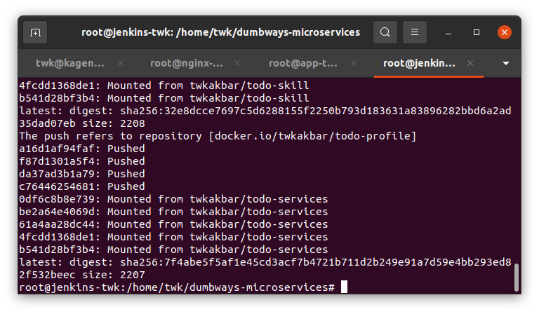

18. Sekarang jalankan perintah berikut untuk mendeploy:

```
kubectl apply -f kubernetes.yml
```

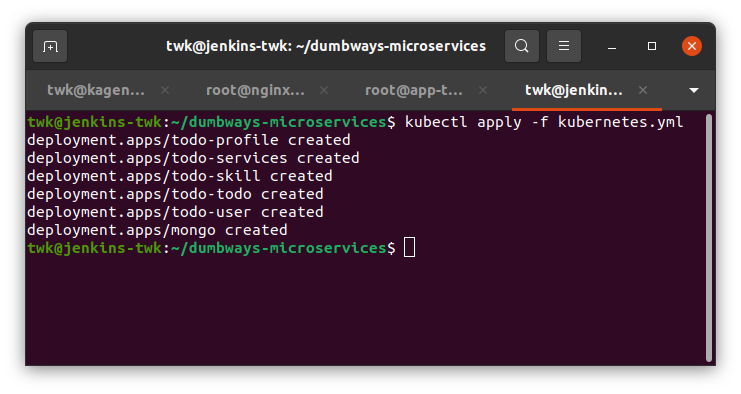

19. Berikut hasilnya

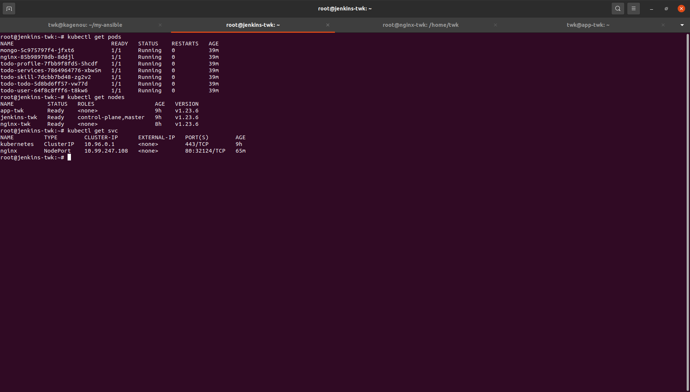

Dan hasil nginx di web browser

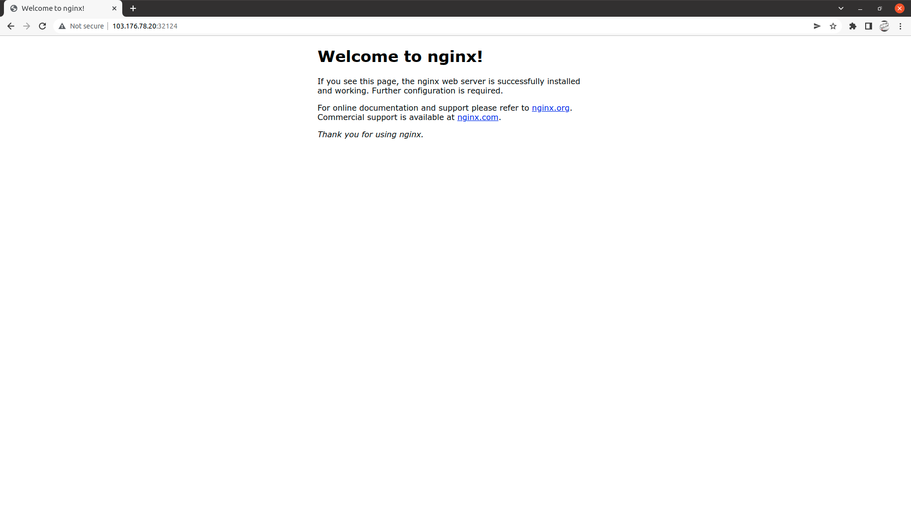
